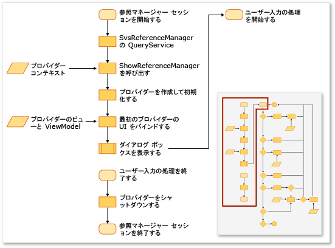
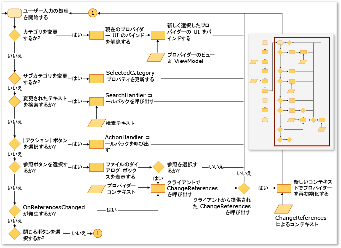

# 参照マネージャーの拡張
Visual Studio 拡張機能の参照マネージャーを使用して、プロジェクトに参照を追加できます。 参照マネージャーが表示される前に、プロジェクトが適切な場所からデータを表示するよう構成する必要があります。 たとえば、[!INCLUDE[net_v40_short](../misc/includes/net_v40_short_md.md)] を対象とするプロジェクトは、[!INCLUDE[net_v35_long](../misc/includes/net_v35_long_md.md)] を対象とするプロジェクトとは異なるフォルダーからアセンブリを作成する必要があります。  
  
 通常、次のプロバイダーからの ProviderContexts のコレクションを使用して、参照マネージャーを構成します。  
  
-   <xref:Microsoft.VisualStudio.Shell.Interop.IVsAssemblyReferenceProviderContext>  
  
-   <xref:Microsoft.VisualStudio.Shell.Interop.IVsComReferenceProviderContext>  
  
-   <xref:Microsoft.VisualStudio.Shell.Interop.IVsFileReferenceProviderContext>  
  
-   <xref:Microsoft.VisualStudio.Shell.Interop.IVsProjectReferenceProviderContext>  
  
-   <xref:Microsoft.VisualStudio.Shell.Interop.IVsPlatformReferenceProviderContext>  
  
 クライアント コンポーネントは、SVsReferenceManager という名前の Visual Studio サービスに対して ShowReferenceManager メソッドを呼び出すことにより、参照マネージャーを表示します。 IVsReferenceProviderContext クラスのコレクションは、このメソッドに引数として渡されます。 これらのコンテキストにより、\[参照マネージャー\] ダイアログ ボックスの左側に表示されるタブが決まります。 各プロバイダーには、プロジェクトに参照を追加するために必要なデータを、ダイアログ ボックスが設定および表示するために必要なすべての情報が含まれます。  
  
 次の図は、このプロセスをまとめたものです。  
  
   
  
   
  
## カスタム タブの作成  
 カスタム タブを追加するには、IReferenceProvider、IVsReference、および IVsReferenceProviderContext を実装する必要があります。  
  
#### カスタム タブを追加するには  
  
1.  IReferenceProvider インターフェイスを実装した後、参照マネージャーがそれを使用できるように、MEF \(Managed Extensibility Framework\) を使用してエクスポートします。  
  
     参照マネージャーは、ReferenceProvider オブジェクトを使用して、参照マネージャーに表示される項目を生成します。 そのオブジェクトのインターフェイスは、Microsoft.VisualStudio.ReferenceManager.Contracts.dll で定義されます。  
  
2.  ProviderContext オブジェクトを実装します。  
  
     参照マネージャーは、このオブジェクトの GUID プロパティを使用して、プロバイダーにコンテキストを一致させます。 参照マネージャーの初期化時に、ShowReferenceManager メソッドを通じて渡される ProviderContext がプロバイダーに渡されます。 ProviderContext には、プロバイダーが IVsReferences を列挙するために必要なすべての情報を含める必要があります。  
  
3.  StandardReferenceProviderContext クラスを拡張します。  
  
     参照マネージャーは、手始めに使用できる StandardReferenceProviderContext クラスなどのいくつかの基底クラスを提供します。 プロバイダー クラスは StandardReferenceProvider を拡張することが可能で、参照項目は StandardReferenceItem を拡張できます。  
  
 プロバイダー クラスは、次の例のようになります。  
  
```  
[Export(typeof(IReferenceProvider))] [ExportMetadata("Name", "AssemblyReferenceProvider")] [ExportMetadata("Guid", VSConstants.AssemblyReferenceProvider_string)] internal class AssemblyReferenceProvider : StandardReferenceProvider { }  
```  
  
 コンテキスト クラスは、次の例のようになります。  
  
```  
  
[Export(typeof(IVsReferenceProviderContext))] [Export(typeof(IVsAssemblyReferenceProviderContext))] [Export("AssemblyReferenceProviderContext", typeof(IVsReferenceProviderContext))] [Export(VSConstants.AssemblyReferenceProvider_string, typeof(IVsReferenceProviderContext))] [PartCreationPolicy(System.ComponentModel.Composition.CreationPolicy.NonShared)] [ExportMetadata("Name", "AssemblyReferenceProviderContext")] [ExportMetadata("Guid", VSConstants.AssemblyReferenceProvider_string)] public class AssemblyReferenceProviderContext : StandardReferenceProviderContext<IVsAssemblyReference, AssemblyIdentity>, IVsAssemblyReferenceProviderContext { }  
```  
  
 参照項目クラスとして IWatchableReference を実装して、クラスをシリアル化可能にすることをお勧めします。 この方法に従えば、ダイアログ ボックス内の各種タブの間で項目のチェックを自動的に同期する ReferenceWatcher サービスに加えて、StandardReferenceProvider クラスでキャッシュのシリアル化メソッドを利用できます。  
  
```  
[Serializable] public class StandardReferenceItem : IWatchableReference { }  
```  
  
 ReferenceProvider クラスには、2 つの重要なメソッドが含まれています。 最初のメソッドは Initialize で、ダイアログ ボックスにプロバイダーが最初に読み込まれるときに一度だけ呼び出されます。 2 番目のメソッドは SetContext で、Initialize の直後に呼び出されますが、指定した後でコミットしようとした参照を追加するために、プロジェクト システムが失敗した場合にもう一度呼び出すことができます。  
  
> [!NOTE]
>  プロバイダーはプログラムの実行中、保持されるため、セッションの間で状態を保存することができますが、ユーザーがダイアログ ボックスを閉じ、すぐに開いた場合、競合状態が発生する可能性があります。  
  
## タブの列挙体の既存のソースをオーバーライドします。  
 一部のプロバイダー コンテキストには、型が uint の、Tabs というプロパティがあります。 このプロパティはビットマスクであり、その値はそのプロバイダーがどのタブを表示するかを制御します。  たとえば、IVsAssemblyReferenceProviderContext インターフェイスには、次の値に設定することができる Tabs プロパティを定義します。  
  
```  
namespace Microsoft.VisualStudio.Shell.Interop { public enum __VSASSEMBLYPROVIDERTAB { TAB_ASSEMBLY_FRAMEWORK = 1, TAB_ASSEMBLY_EXTENSIONS = 2, TAB_ASSEMBLY_ALL = 3, } }  
```  
  
 IVsPlatformReferenceProviderContext クラスには、同じようなプロパティがあります。 タブ名を変更することはできませんが、ユーザーがタブを選択するときに表示されるヘッダー テキストを制御できます。 IVsAssemblyProviderContext クラスでは、次のメソッドを使用して、この値を制御できます。  
  
```  
void SetTabTitle(uint etabId, string szTabTitle);  
```  
  
## \[参照\] ダイアログ ボックス内のフィルターをオーバーライドします。  
 IFileReferenceProviderContext オブジェクトの BrowseFilter プロパティの値を変更することで、参照マネージャーの \[参照\] ダイアログ ボックスにカスタム型フィルターを指定できます。  次の例では、ネイティブ コードからこの手法を示します。  
  
```  
  
// Holds a list of provider contexts CComSafeArray<LPUNKNOWN> spProviderContexts; // Creates the file reference context for Browse vsReferenceManager->CreateProviderContext(GUID_FileReferenceProvider, &pFileRefProviderContext)); // Sets the Browse filter pFileRefProviderContext->put_BrowseFilter(wszFilter); spProviderContexts.Add(pFileRefProviderContext); // Show the reference manager hr = srpRefMgr->ShowReferenceManager( spVsRefMgrUser, spProviderContexts, strTitle, HELPKEYWORD_AddReference, GUID_AssemblyReferenceProvider, wszFilter, m_bstrStartBrowse);  
```  
  
## 参照  
 [方法: 参照マネージャーを使用して参照を追加または削除する](../Topic/How%20to:%20Add%20or%20Remove%20References%20By%20Using%20the%20Reference%20Manager.md)