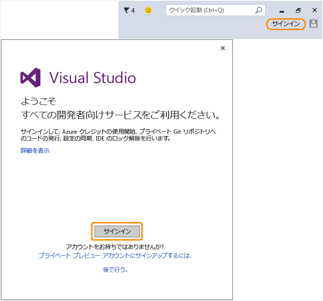

# Visual Studio に戻り、新しい Microsoft アカウントを使用して IDE にサインインします。
Microsoft アカウントが正常に作成されました。 Visual Studio に戻り、最初の起動時に \[ようこそ\] ウィザードからサインインします。または、好きなときに IDE の右上隅からサインインします。  
  
 IDE にサインインして、Azure クレジットの使用の開始、プライベート Git リポジトリへのコードの発行、設定の同期、および IDE のロック解除を実行します。 使用可能なすべての開発者サービスの詳細については、[こちら](../Topic/Signing%20in%20to%20Visual%20Studio.md)を参照してください。  
  
 