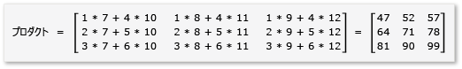
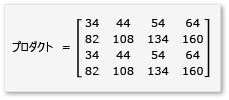

# チュートリアル : 行列乗算
[!INCLUDE[vs2017banner](../../assembler/inline/includes/vs2017banner.md)]

このチュートリアルでは、C\+\+ AMP を使用して行列乗算の実行を高速化する方法を示します。  タイルを使用する場合と使用しない場合の 2 つのアルゴリズムを紹介します。  
  
## 必須コンポーネント  
 開始する前に:  
  
-   [C\+\+ AMP の概要](../../parallel/amp/cpp-amp-overview.md) を読み取りました。  
  
-   [タイルの使用](../../parallel/amp/using-tiles.md) を読み取りました。  
  
-   [!INCLUDE[win7](../../build/includes/win7_md.md)]、[!INCLUDE[win8](../../build/includes/win8_md.md)]、[!INCLUDE[winsvr08_r2](../../parallel/amp/includes/winsvr08_r2_md.md)]、または [!INCLUDE[winserver8](../../build/includes/winserver8_md.md)] がコンピューターにインストールされていることを確認します。  
  
### プロジェクトを作成するには  
  
1.  Visual Studio のメニュー バーで、**\[ファイル\]**、**\[新規作成\]**、**\[プロジェクト\]** の順にクリックします。  
  
2.  テンプレート ペインの **\[インストール済み\]** で **\[Visual C\+\+\]** をクリックします。  
  
3.  **\[空のプロジェクト\]** を選択し、**\[名前\]** ボックスに「`MatrixMultiply`」と入力して、**\[OK\]** をクリックします。  
  
4.  **\[次へ\]** ボタンをクリックします。  
  
5.  **ソリューション エクスプローラー**で **\[ソース ファイル\]** のショートカット メニューを開き、**\[追加\]**、**\[新しい項目\]** の順に選択します。  
  
6.  **\[新しい項目の追加\]** ダイアログ ボックスで、**\[C\+\+ ファイル \(.cpp\)\]** を選択し、**\[名前\]** ボックスに「`MatrixMultiply.cpp`」と入力して、**\[追加\]** をクリックします。  
  
## タイルを使用しない乗算  
 ここでは、次のように定義されている 2 つの行列 A と B の乗算を考えます。  
  
   
  
   
  
 A は、3 × 2 の行列であり、B は 2 × 3 の行列です。  A と B を乗算した積は、次のような 3 × 3 の行列になります。  この積は、要素ごとに A の行と B の列を乗算することによって計算されます。  
  
   
  
### C\+\+ AMP を使用せずに乗算するには  
  
1.  MatrixMultiply.cpp を開き、次のコードを使用して既存のコードを置き換えます。  
  
    ```cpp  
  
    #include <iostream>  
  
    void MultiplyWithOutAMP() {  
  
        int aMatrix[3][2] = {{1, 4}, {2, 5}, {3, 6}};  
        int bMatrix[2][3] = {{7, 8, 9}, {10, 11, 12}};  
        int product[3][3] = {{0, 0, 0}, {0, 0, 0}, {0, 0, 0}};  
  
        for (int row = 0; row < 3; row++) {  
            for (int col = 0; col < 3; col++) {  
                // Multiply the row of A by the column of B to get the row, column of product.  
                for (int inner = 0; inner < 2; inner++) {  
                    product[row][col] += aMatrix[row][inner] * bMatrix[inner][col];  
                }  
                std::cout << product[row][col] << "  ";  
            }  
            std::cout << "\n";  
        }  
    }  
  
    void main() {  
        MultiplyWithOutAMP();  
        getchar();  
    }  
  
    ```  
  
     このアルゴリズムは、行列乗算の定義の単純な実装です。  計算時間を短縮するスレッド アルゴリズムや並列アルゴリズムは使用していません。  
  
2.  メニュー バーで、**\[ファイル\]**、**\[すべてを保存\]** の順に選択します。  
  
3.  F5 キーを押してデバッグを開始し、出力が正しいことを確認します。  
  
4.  Enter キーを押してアプリケーションを終了します。  
  
### C\+\+ AMP を使用して乗算するには  
  
1.  MatrixMultiply.cpp で、`main` のメソッドの前に次のコードを追加します。  
  
    ```cpp  
  
    void MultiplyWithAMP() {  
        int aMatrix[] = { 1, 4, 2, 5, 3, 6 };  
        int bMatrix[] = { 7, 8, 9, 10, 11, 12 };  
        int productMatrix[] = { 0, 0, 0, 0, 0, 0, 0, 0, 0 };  
  
        array_view<int, 2> a(3, 2, aMatrix);  
        array_view<int, 2> b(2, 3, bMatrix);  
        array_view<int, 2> product(3, 3, productMatrix);  
  
        parallel_for_each(  
            product.extent,   
             [=](index<2> idx) restrict(amp) {  
                int row = idx[0];  
                int col = idx[1];  
                for (int inner = 0; inner < 2; inner++) {  
                    product[idx] += a(row, inner) * b(inner, col);  
                }  
            }  
        );  
  
        product.synchronize();  
  
        for (int row = 0; row < 3; row++) {  
            for (int col = 0; col < 3; col++) {  
                //std::cout << productMatrix[row*3 + col] << "  ";  
                std::cout << product(row, col) << "  ";  
            }  
            std::cout << "\n";  
        }  
    }  
  
    ```  
  
     この AMP コードは、非 AMP コードに似ています。  `parallel_for_each` の呼び出しは、`product.extent` の各要素について 1 つのスレッドを開始し、行と列の `for` ループを置き換えます。  行と列のセルの値は `idx` で使用できます。  `[]` 演算子とインデックス変数、または `()` 演算子と行と列の変数を使用することによって、`array_view` のオブジェクトの要素にアクセスできます。  この例では両方の方法を示します。  `array_view::synchronize` メソッドは `productMatrix` の変数に `product` 変数の値をコピーします。  
  
2.  MatrixMultiply.cpp の先頭に、次の `include` ステートメントと `using` ステートメントを追加します。  
  
    ```cpp  
  
    #include <amp.h>  
    using namespace concurrency;  
  
    ```  
  
3.  `MultiplyWithAMP` メソッドを呼び出すように `main` メソッドを変更します。  
  
    ```cpp  
  
    void main() {  
        MultiplyWithOutAMP();  
        MultiplyWithAMP();  
        getchar();  
    }  
  
    ```  
  
4.  Ctrl キーを押しながら F5 キーを押してデバッグを開始し、出力が正しいことを確認します。  
  
5.  Space キーを押してアプリケーションを終了します。  
  
## タイルを使用する乗算  
 タイルは、データを tiles と呼ばれる同じサイズのサブセットに分割する手法です。  タイルを使用する場合、3 つ点が異なります。  
  
-   `tile_static` 変数を作成できます。  `tile_static` 空間のデータへのアクセスは、グローバル空間内のデータへのアクセスよりも何倍も高速になる場合があります。  各タイルについて `tile_static` 変数のインスタンスが作成され、タイル内のすべてのスレッドがこの変数にアクセスできます。  タイルの主な利点は、`tile_static` へのアクセスによるパフォーマンスの向上です。  
  
-   [tile\_barrier::wait](../Topic/tile_barrier::wait%20Method.md) メソッドを呼び出すことによって、指定したコード行で 1 個のタイル内のすべてのスレッドを停止できます。  スレッドが実行される順序を保証することはできません。ただ、1 個のタイル内のすべてのスレッドが、実行を続ける前に `tile_barrier::wait` の呼び出しで停止するだけです。  
  
-   `array_view` オブジェクト全体を基準とするスレッドのインデックス、およびタイルを基準とするインデックスにアクセスできます。  ローカル インデックスを使うと、コードが読みやすくなり、デバッグも容易になります。  
  
 行列乗算でタイルを活用するには、アルゴリズムによって、行列をタイルに分割し、すばやくアクセスできるようにタイルのデータを `tile_static` 変数にコピーする必要があります。  この例では、行列は同じサイズのサブ行列に分割されます。  積はサブ行列を乗算することによって得られます。  この例の 2 つの行列とその積は次のとおりです。  
  
   
  
   
  
   
  
 この行列は、次のように定義された 4 個の 2 × 2 の行列に分割されます。  
  
   
  
   
  
 A と B の積は、次のように記述し、計算できます:  
  
   
  
 行列 `a` ～ `h` は 2 × 2 の行列であるため、すべての積とその合計も 2 × 2 の行列になります。  また、期待どおり、A\*B は 4 × 4 の行列になります。  アルゴリズムをすばやく確認するには、積の最初の行、最初の列の要素の値を計算します。  この例では、`ae + bg` の最初の行と最初の列の要素の値です。  各項について、`ae` と `bg` の最初の列と最初の行のみ計算する必要があります。  `ae` の値は `1*1 + 2*5 = 11` です。  `bg` の値は `3*1 + 4*5 = 23` です。  最終的な値は `11 + 23 = 34` となり、正しい値です。  
  
 このアルゴリズムを実装するには、コードで次のように処理します。  
  
-   `parallel_for_each` の呼び出しで `extent` オブジェクトではなく `tiled_extent` オブジェクトを使用します。  
  
-   `parallel_for_each` の呼び出しで `index` オブジェクトではなく `tiled_index` オブジェクトを使用します。  
  
-   サブ行列を保持する `tile_static` 変数を作成します。  
  
-   `tile_barrier::wait` メソッドを使用して、サブ行列の積を計算するためのスレッドを停止します。  
  
### AMP とタイルを使用して乗算するには  
  
1.  MatrixMultiply.cpp で、`main` のメソッドの前に次のコードを追加します。  
  
    ```cpp  
  
    void MultiplyWithTiling()  
    {  
        // The tile size is 2.  
        static const int TS = 2;  
  
        // The raw data.  
        int aMatrix[] =       { 1, 2, 3, 4, 5, 6, 7, 8, 1, 2, 3, 4, 5, 6, 7, 8 };  
        int bMatrix[] =       { 1, 2, 3, 4, 5, 6, 7, 8, 1, 2, 3, 4, 5, 6, 7, 8 };  
        int productMatrix[] = { 0, 0, 0, 0, 0, 0, 0, 0, 0, 0, 0, 0, 0, 0, 0, 0 };  
  
        // Create the array_view objects.  
        array_view<int, 2> a(4, 4, aMatrix);  
        array_view<int, 2> b(4, 4, bMatrix);  
        array_view<int, 2> product(4, 4, productMatrix);  
  
        // Call parallel_for_each by using  2x2 tiles.  
        parallel_for_each(product.extent.tile< TS, TS >(),  
            [=] (tiled_index< TS, TS> t_idx) restrict(amp)   
            {  
                // Get the location of the thread relative to the tile (row, col) and the entire array_view (rowGlobal, colGlobal).  
                int row = t_idx.local[0];   
                int col = t_idx.local[1];  
                int rowGlobal = t_idx.global[0];  
                int colGlobal = t_idx.global[1];  
                int sum = 0;  
  
                // Given a 4x4 matrix and a 2x2 tile size, this loop executes twice for each thread.  
                // For the first tile and the first loop, it copies a into locA and e into locB.  
                // For the first tile and the second loop, it copies b into locA and g into locB.  
                for (int i = 0; i < 4; i += TS) {  
                    tile_static int locA[TS][TS];  
                    tile_static int locB[TS][TS];  
                    locA[row][col] = a(rowGlobal, col + i);  
                    locB[row][col] = b(row + i, colGlobal);  
                    // The threads in the tile all wait here until locA and locB are filled.  
                    t_idx.barrier.wait();  
  
                    // Return the product for the thread. The sum is retained across  
                    // both iterations of the loop, in effect adding the two products  
                    // together, for example, a*e.  
                    for (int k = 0; k < TS; k++) {  
                        sum += locA[row][k] * locB[k][col];  
                    }  
  
                    // All threads must wait until the sums are calculated. If any threads  
                    // moved ahead, the values in locA and locB would change.        
                    t_idx.barrier.wait();  
                    // Now go on to the next iteration of the loop.            
                }  
  
                // After both iterations of the loop, copy the sum to the product variable by using the global location.  
                product[t_idx.global] = sum;  
        });  
  
            // Copy the contents of product back to the productMatrix variable.  
            product.synchronize();  
  
            for (int row = 0; row < 4; row++) {  
            for (int col = 0; col < 4; col++) {  
                // The results are available from both the product and productMatrix variables.  
                //std::cout << productMatrix[row*3 + col] << "  ";  
                std::cout << product(row, col) << "  ";  
            }  
            std::cout << "\n";  
        }  
  
    }  
  
    ```  
  
     この例は、タイルを使用しない例とは大きく異なります。  このコードでは、次のような概念的な手順を使用します。  
  
    1.  `a` の tile\[0,0\] の要素を `locA` にコピーします。  `b` の tile\[0,0\] の要素を `locB` にコピーします。  `product` はタイル化されていますが、`a` と `b` はタイル化されていないことに注意してください。  したがって、`a, b` および `product` にアクセスするにはグローバル インデックスを使用します。  `tile_barrier::wait` の呼び出しは不可欠です。  これは、`locA` と `locB` の両方が設定されるまで、タイル内のすべてのスレッドを停止します。  
  
    2.  `locA` と `locB` を乗算し、その結果を `product` に代入します。  
  
    3.  `a` の tile\[0,1\] の要素を `locA` にコピーします。  `b` の tile\[1,0\] の要素を `locB` にコピーします。  
  
    4.  `locA` と `locB` を乗算し、その結果を `product` に既に存在する結果に加算します。  
  
    5.  tile\[0,0\] の乗算が完了しました。  
  
    6.  他の 4 個のタイルについても手順を繰り返します。  タイル用のインデックスはないため、スレッドは任意の順序で実行できます。  各スレッドの実行時に、各タイルについて `tile_static` 変数が適切に作成され、`tile_barrier::wait` の呼び出しによってプログラム フローが制御されます。  
  
    7.  アルゴリズムを詳しく調べると、各サブ行列は `tile_static` のメモリに 2 回読み込まれていることがわかります。  このデータ転送には時間がかかります。  ただし、データが `tile_static` のメモリにある場合、データへのアクセスははるかに高速です。  積を計算するにはサブ行列内の値に繰り返しアクセスする必要があるため、全体的なパフォーマンスは向上します。  最適なアルゴリズムとタイルのサイズを見つけるために、各アルゴリズムについて実験を行う必要があります。  
  
         非 AMP と非タイルの例では、積を計算するために、A と B の各要素がグローバル メモリから 4 回アクセスされます。  タイルの例では、各要素がグローバル メモリから 2 回、`tile_static` のメモリから 4 回アクセスされます。  これは大幅なパフォーマンスの向上ではありません。  ただし、A と B が 1024 × 1024 の行列であり、タイルのサイズが 16 である場合は、パフォーマンスが大幅に向上します。  この場合には、各要素が、`tile_static` のメモリに 16 回だけコピーされ、`tile_static` のメモリから 1024 回アクセスされます。  
  
2.  次に示すように、main メソッドを変更して `MultiplyWithTiling` メソッドを呼び出します。  
  
    ```cpp  
  
    void main() {  
        MultiplyWithOutAMP();  
        MultiplyWithAMP();  
        MultiplyWithTiling();  
        getchar();  
    }  
  
    ```  
  
3.  Ctrl キーを押しながら F5 キーを押してデバッグを開始し、出力が正しいことを確認します。  
  
4.  Space キーを押してアプリケーションを終了します。  
  
## 参照  
 [C\+\+ AMP \(C\+\+ Accelerated Massive Parallelism\)](../../parallel/amp/cpp-amp-cpp-accelerated-massive-parallelism.md)   
 [チュートリアル : C\+\+ AMP アプリケーションのデバッグ](../../parallel/amp/walkthrough-debugging-a-cpp-amp-application.md)