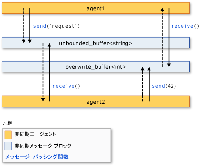

# <a name="asynchronous-agents-library"></a>非同期エージェント ライブラリ
非同期エージェント ライブラリ (または単*エージェント ライブラリ*) 同時実行対応アプリケーション開発の保全性を向上できるプログラミング モデルを提供します。 エージェント ライブラリは、アクターベースのプログラミング モデルと、粒度の粗いデータ フローおよびパイプライン処理タスクのためのインプロセス メッセージ パッシングを推進する C++ テンプレート ライブラリです。 エージェント ライブラリは、同時実行ランタイムのスケジューリング コンポーネントとリソース管理コンポーネントに基づいています。  
  
## <a name="programming-model"></a>プログラミング モデル  
 エージェント ライブラリは、制御フローではなくデータ フローに基づく非同期通信モデルを使用して分離コンポーネントを接続できるようにすることで、共有状態に代わる手段を提供します。 *データ フロー*プログラミングを指す必要なすべてのデータと計算が行われる場所モデルが使用可能です。*制御フロー*あらかじめ決められた順序で計算が行われる場所のプログラミング モデルを参照します。  
  
 データ フロー プログラミング モデルは、プログラムの独立したコンポーネントがメッセージの送信によって相互に通信する、*メッセージ パッシング*の概念に関連しています。  
  
 エージェント ライブラリは 3 つのコンポーネントで構成されます:*非同期エージェント*、*非同期メッセージ ブロック*、および*メッセージ パッシング関数*です。 エージェントは状態を保持し、メッセージ ブロックとメッセージ パッシング関数を使用して相互の通信および外部コンポーネントとの通信を行います。 メッセージ パッシング関数は、エージェントが外部コンポーネントとの間でメッセージを送受信できるようにします。 非同期メッセージ ブロックは、メッセージを保持し、エージェントが同期的に通信を行うことができるようにします。  
  
 次の図は、2 つのエージェントがメッセージ ブロックとメッセージ パッシング関数を使用して通信する方法を示しています。 この図で`agent1`にメッセージを送信`agent2`を使用して、 [concurrency::send](reference/concurrency-namespace-functions.md#send)関数と[concurrency::unbounded_buffer](reference/unbounded-buffer-class.md)オブジェクト。 `agent2`使用して、 [concurrency::receive](reference/concurrency-namespace-functions.md#receive)メッセージを読み取る関数。 `agent2` は、同じメソッドを使用して `agent1` にメッセージを送信します。 破線の矢印は、エージェント間のデータの流れを表しています。 実線の矢印は、エージェントと、それが読み書きを行う対象のメッセージ ブロックを結んでいます。  
  
   
  
 この図を実装するコード例については、このトピックで後述します。  
  
 エージェント プログラミング モデルには、他の同時実行機構および同期機構 (イベントなど) に比べていくつかの利点があります。 利点の 1 つは、メッセージ パッシングを使用してオブジェクト間で状態の変更を送信することで共有リソースへのアクセスを分離でき、スケーラビリティを向上できるという点です。 メッセージ パッシングの利点は、同期を外部同期オブジェクトに結び付けるのではなく、データに結び付けるという点にあります。 これにより、コンポーネント間のデータ伝送が簡略化され、アプリケーションのプログラミング エラーを防ぐことができます。  
  
## <a name="when-to-use-the-agents-library"></a>エージェント ライブラリを使用する場合  
 エージェント ライブラリは、相互に非同期通信を行う必要がある複数の操作がある場合に使用します。 メッセージ ブロックとメッセージ パッシング関数を使用すると、ロックなどの同期機構を必要とせずに並行アプリケーションを作成できます。 これにより、アプリケーション ロジックに集中することができます。  
  
 エージェント プログラミング モデルは、作成によく使用*データ パイプライン*または*ネットワーク*です。 データ パイプラインは一連のコンポーネントで、その各コンポーネントは、より大きな目標を達成するための特定のタスクを実行します。 データフロー パイプラインのすべてのコンポーネントは、他のコンポーネントからメッセージを受け取ったときに処理を実行します。 その処理の結果は、パイプラインまたはネットワーク内の別のコンポーネントに渡されます。 コンポーネントはその他のライブラリからより多くの同時実行の詳細な機能をたとえば使用できます、[並列パターン ライブラリ (PPL)](../../parallel/concrt/parallel-patterns-library-ppl.md)です。  
  
## <a name="example"></a>例  
 前述した図を実装する例を次に示します。  
  
 [!code-cpp[concrt-basic-agents#1](../../parallel/concrt/codesnippet/cpp/asynchronous-agents-library_1.cpp)]  
  
 この例を実行すると、次の出力が生成されます。  
  
```Output  
agent1: sending request...  
agent2: received 'request'.  
agent2: sending response...  
agent1: received '42'.  
```  
  
 この例で使用されている機能の詳細については、次のトピックを参照してください。  
  
## <a name="related-topics"></a>関連トピック  
 [非同期エージェント](../../parallel/concrt/asynchronous-agents.md)  
 大規模なコンピューティング タスクの解決における非同期エージェントの役割について説明します。  
  
 [非同期メッセージ ブロック](../../parallel/concrt/asynchronous-message-blocks.md)  
 エージェント ライブラリに用意されているさまざまなメッセージ ブロックの型について説明します。  
  
 [メッセージ パッシング関数](../../parallel/concrt/message-passing-functions.md)  
 エージェント ライブラリに用意されているさまざまなメッセージ パッシング ルーチンについて説明します。  
  
 [方法: さまざまなプロデューサー/コンシューマー パターンを実装する](../../parallel/concrt/how-to-implement-various-producer-consumer-patterns.md)  
 アプリケーションにプロデューサー/コンシューマー パターンを実装する方法について説明します。  
  
 [方法: call クラスおよび transformer クラスに処理関数を提供する](../../parallel/concrt/how-to-provide-work-functions-to-the-call-and-transformer-classes.md)  
 処理関数を提供するいくつかの方法を示しています、 [concurrency::call](../../parallel/concrt/reference/call-class.md)と[concurrency::transformer](../../parallel/concrt/reference/transformer-class.md)クラスです。  
  
 [方法: データ パイプラインでトランスフォーマーを使用する](../../parallel/concrt/how-to-use-transformer-in-a-data-pipeline.md)  
 使用する方法を示します、 [concurrency::transformer](../../parallel/concrt/reference/transformer-class.md)データ パイプラインでのクラスです。  
  
 [方法: 完了したタスクから選択する](../../parallel/concrt/how-to-select-among-completed-tasks.md)  
 使用する方法を示します、 [concurrency::choice](../../parallel/concrt/reference/choice-class.md)と[concurrency::join](../../parallel/concrt/reference/join-class.md)クラスを検索アルゴリズムを完了する最初のタスクを選択します。  
  
 [方法: メッセージを定期的に送信する](../../parallel/concrt/how-to-send-a-message-at-a-regular-interval.md)  
 使用する方法を示します、 [concurrency::timer](../../parallel/concrt/reference/timer-class.md)を定期的にメッセージを送信するクラス。  
  
 [方法: メッセージ ブロック フィルターを使用する](../../parallel/concrt/how-to-use-a-message-block-filter.md)  
 フィルターを使用して、非同期メッセージ ブロックでメッセージの受け入れや拒否が行われるようにする方法について説明します。  
  
 [並列パターン ライブラリ (PPL)](../../parallel/concrt/parallel-patterns-library-ppl.md)  
 アプリケーションで各種の並列パターン (並列アルゴリズムなど) を使用する方法について説明します。  
  
 [同時実行ランタイム](../../parallel/concrt/concurrency-runtime.md)  
 並列プログラミングを容易にする同時実行ランタイムについて説明します。また、関連トピックへのリンクを示します。

