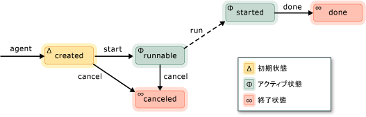

# 非同期エージェント
[!INCLUDE[vs2017banner](../../assembler/inline/includes/vs2017banner.md)]

*非同期エージェント*は、他のエージェントと非同期的にやり取りしてより大きなコンピューティング タスクを解決するアプリケーション コンポーネントです。単に "*エージェント*" と呼ばれることもあります。  エージェントは一定のライフ サイクルを持ったタスクと考えることができます。  たとえば、あるエージェントが入力\/出力デバイス \(キーボード、ディスク上のファイル、ネットワーク接続など\) からデータを読み取り、そのデータが利用できる状態になったら別のエージェントがそのデータに対して処理を実行します。  1 つ目のエージェントは、使用できるデータが他にもあれば、2 つ目のエージェントにメッセージを渡すことによってそのことを伝達します。  同時実行ランタイムのタスク スケジューラは、非効率なプリエンプションを用いず、エージェントによって協調的に実行をブロックしたり譲歩したりできる効率的なメカニズムです。  
  
 エージェント ライブラリは、非同期エージェントを表すために [concurrency::agent](../../parallel/concrt/reference/agent-class.md) クラスを定義します。  `agent` は 仮想メソッド [concurrency::agent::run](../Topic/agent::run%20Method.md)を宣言する抽象クラスです。  エージェントによって遂行されるタスクは、`run` メソッドによって実行されます。  `run` は抽象クラスであるため、`agent` から派生したすべてのクラスにはこのメソッドを実装する必要があります。  
  
## エージェントのライフ サイクル  
 エージェントには一定のライフ サイクルがあります。  [concurrency::agent\_status](../Topic/agent_status%20Enumeration.md) の列挙体はエージェントのさまざまな状態を定義します。  エージェントの状態がどのように推移するかを次の図に示します。  この図の中で、実線はアプリケーションから呼び出すメソッドを、点線はランタイムから呼び出されるメソッドを表します。  
  
   
  
 `agent_status` 列挙型に含まれる個々の状態を次の表に示します。  
  
|エージェントの状態|説明|  
|---------------|--------|  
|`agent_created`|エージェントの実行はまだスケジュールされていません。|  
|`agent_runnable`|ランタイムがエージェントの実行をスケジュール中です。|  
|`agent_started`|エージェントは開始されて実行中です。|  
|`agent_done`|エージェントは完了しました。|  
|`agent_canceled`|エージェントは `started` 状態になる前に取り消されました。|  
  
 `agent_created` がエージェントの初期状態です。また、`agent_runnable` と `agent_started` はアクティブな状態を、`agent_done` と `agent_canceled` は終了状態を表します。  
  
 `agent` オブジェクトの現在の状態を取得するために [concurrency::agent::status](../Topic/agent::status%20Method.md) のメソッドを使用します。  `status` は同時実行セーフなメソッドですが、`status` メソッドから制御が戻るまでにエージェントの状態が変化する場合があります。  たとえば、`status` メソッドを呼び出した時点でエージェントの状態が `agent_started` だったとして、`status` メソッドから制御が戻った直後には `agent_done` 状態になっていることも考えられます。  
  
## メソッドおよび機能  
 次の表に、`agent` クラスの重要なメソッドをいくつか示します。  `agent` クラスのすべてのメソッドの詳細については、「[agent クラス](../../parallel/concrt/reference/agent-class.md)」を参照してください。  
  
|方法|説明|  
|--------|--------|  
|[start](../Topic/agent::start%20Method.md)|`agent` オブジェクトの実行をスケジュールし、`agent_runnable` 状態に設定します。|  
|[run](../Topic/agent::run%20Method.md)|`agent` オブジェクトが遂行することになっているタスクを実行します。|  
|[done](../Topic/agent::done%20Method.md)|エージェントを `agent_done` 状態に移行させます。|  
|[cancel](../Topic/agent::cancel%20Method.md)|エージェントが開始されていなかった場合、このメソッドは、エージェントの実行を取り消して、`agent_canceled` 状態に設定します。|  
|[status](../Topic/agent::status%20Method.md)|`agent` オブジェクトの現在の状態を取得します。|  
|[wait](../Topic/agent::wait%20Method.md)|`agent` オブジェクトが `agent_done` 状態または `agent_canceled` 状態になるまで待機します。|  
|[wait\_for\_all](../Topic/agent::wait_for_all%20Method.md)|指定されたすべての `agent` オブジェクトが `agent_done` 状態または `agent_canceled` 状態になるまで待機します。|  
|[wait\_for\_one](../Topic/agent::wait_for_one%20Method.md)|指定された `agent` オブジェクトが少なくとも 1 つ `agent_done` 状態または `agent_canceled` 状態になるまで待機します。|  
  
 エージェント オブジェクトを作成したら、それを適用するに [concurrency::agent::start](../Topic/agent::start%20Method.md) のメソッドを呼び出します。  エージェントのスケジュール後、ランタイムが `run` メソッドを呼び出し、その状態を `agent_runnable` に設定します。  
  
 ランタイムは非同期エージェントによってスローされた例外を管理しません。  例外処理とエージェントの詳細については、「[例外処理](../Topic/Exception%20Handling%20in%20the%20Concurrency%20Runtime.md)」を参照してください。  
  
## 例  
 基本的なエージェント ベースのアプリケーションを作成する方法の例については、「[チュートリアル: エージェント ベースのアプリケーションの作成](../../parallel/concrt/walkthrough-creating-an-agent-based-application.md)」を参照してください。  
  
## 参照  
 [非同期エージェント ライブラリ](../../parallel/concrt/asynchronous-agents-library.md)