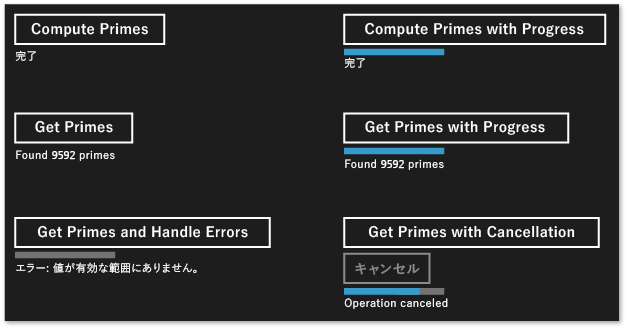

# C++ における Windows ストア アプリ用の非同期操作の作成
[!INCLUDE[vs2017banner](../../assembler/inline/includes/vs2017banner.md)]

このドキュメントでは、タスク クラスを使用して、[!INCLUDE[win8_appname_long](../../build/includes/win8_appname_long_md.md)] アプリの Windows ThreadPool ベースの非同期操作を生成する場合に注意する重要な点について説明します。  
  
 非同期プログラミングを使用するとアプリケーションはユーザー入力への応答性を保つことができるため、これは [!INCLUDE[win8_appname_long](../../build/includes/win8_appname_long_md.md)] アプリケーション モデルの重要なコンポーネントです。 UI スレッドをブロックすることなく、長時間実行されるタスクを開始することができ、後でタスクの結果を受け取ることができます。 また、タスクを取り消したり、タスクがバックグラウンドで実行される間に進行状況の通知を受け取ることができます。 「[C\+\+ での非同期プログラミング](http://msdn.microsoft.com/library/windows/apps/Hh780559.aspx)」のドキュメントでは、[!INCLUDE[win8_appname_long](../../build/includes/win8_appname_long_md.md)] アプリケーションを作成するために Visual C\+\+ で使える非同期パターンの概要について説明しています。 このドキュメントでは、[!INCLUDE[wrt](../../atl/reference/includes/wrt_md.md)] の非同期操作のチェーンの使用と作成の両方の方法を解説しています。 このセクションでは、ppltasks.h の型を使用して、[!INCLUDE[wrt](../../atl/reference/includes/wrt_md.md)]の別のコンポーネントで使用できる非同期操作を生成する方法、および非同期処理を実行する方法を制御する方法を説明します。 また、C\+\+ および XAML を使用した [!INCLUDE[win8_appname_long](../../build/includes/win8_appname_long_md.md)] アプリケーションである Hilo で、タスク クラスを使用して非同期操作を実行する方法については、「[Hilo での非同期プログラミング パターンとヒント \(C\+\+ と XAML を使った Windows ストア アプリ\)](http://msdn.microsoft.com/library/windows/apps/jj160321.aspx)」を参照してください。  
  
> [!NOTE]
>  [!INCLUDE[win8_appname_long](../../build/includes/win8_appname_long_md.md)] アプリケーションでは[並列パターン ライブラリ](../../parallel/concrt/parallel-patterns-library-ppl.md) \(PPL\) および [非同期エージェント ライブラリ](../../parallel/concrt/asynchronous-agents-library.md) を使用できます。 ただし、タスク スケジューラとリソース マネージャーを使用することはできません。 このドキュメントでは、PPL が提供する追加機能のうち、[!INCLUDE[win8_appname_long](../../build/includes/win8_appname_long_md.md)] アプリのみで使用でき、デスクトップ アプリケーションでは使用できない機能について説明します。  
  
## 主要なポイント  
  
-   他のコンポーネントで使用する非同期操作 \(C\+\+ 以外の言語で記述される場合があります\) を作成するには、[concurrency::create\_async](../Topic/create_async%20Function.md) を使用します。  
  
-   非同期操作を呼び出すコンポーネントに進行状況の通知をレポートするためには、[concurrency::progress\_reporter](../../parallel/concrt/reference/progress-reporter-class.md) を使用します。  
  
-   内部非同期操作の取り消しを可能にするには、キャンセル トークンを使用します。  
  
-   `create_async` の関数の動作は、渡される処理関数の戻り値の型によって異なります。 タスク \(`task<T>` または `task<void>`\) を返す処理関数は、`create_async` を呼び出したコンテキストで同期的に実行されます。`T` または `void` を返す処理関数は、任意のコンテキストで実行されます。  
  
-   [concurrency::task::then](../Topic/task::then%20Method.md) メソッドを使用すると、順次実行タスクのチェーンを作成できます。[!INCLUDE[win8_appname_long](../../build/includes/win8_appname_long_md.md)] アプリケーションでは、タスクの継続の既定のコンテキストはそのタスクが構築された方法によって異なります。 非同期アクションをタスク コンストラクターに渡すことによってタスクが作成されている場合、または非同期アクションを返すラムダ式を渡すことによってタスクが作成されている場合は、そのタスクのすべての継続の既定のコンテキストは、現在のコンテキストです。 タスクが非同期のアクションから構築されていない場合、既定ではタスクの継続には任意のコンテキストが使用されます。 既定のコンテキストを [concurrency::task\_continuation\_context](../../parallel/concrt/reference/task-continuation-context-class.md) クラスで上書きできます。  
  
## 目次  
  
-   [非同期操作を作成する](#create-async)  
  
-   [例: C\+\+ での Windows ランタイム コンポーネントの作成](#example-component)  
  
-   [実行スレッドを制御する](#exethread)  
  
-   [例: C\+\+ および XAML を使用した Windows ストア アプリでの実行の制御](#example-app)  
  
##   非同期操作を作成する  
 並列パターン ライブラリ \(PPL\) でタスクや継続のモデルを使用して、バックグラウンド タスクを定義したり、前のタスクが完了すると実行される追加のタスクを定義することができます。 この機能は [concurrency::task](../../parallel/concrt/reference/task-class-concurrency-runtime.md) クラスによって提供されます。 このモデルの詳細および `task` クラスの詳細については、「[タスクの並列化](../../parallel/concrt/task-parallelism-concurrency-runtime.md)」を参照してください。  
  
 [!INCLUDE[wrt](../../atl/reference/includes/wrt_md.md)] は、特別なオペレーティング システムの環境でのみ動作する [!INCLUDE[win8_appname_long](../../build/includes/win8_appname_long_md.md)] アプリの作成に使用するプログラミング インターフェイスです。 このようなアプリは承認済みの関数、データ型、およびデバイスを使用し、[!INCLUDE[win8_appstore_long](../../build/reference/includes/win8_appstore_long_md.md)] から配布されます。[!INCLUDE[wrt](../../atl/reference/includes/wrt_md.md)] は、*アプリケーション バイナリ インターフェイス* \(ABI\) によって表されます。 ABI は、[!INCLUDE[wrt](../../atl/reference/includes/wrt_md.md)] API を Visual C\+\+ などのプログラミング言語で使用できるようにするための基になるバイナリ コントラクトです。  
  
 [!INCLUDE[wrt](../../atl/reference/includes/wrt_md.md)] を使用すると、さまざまなプログラミング言語の最適な機能を使用して、それを 1 つのアプリケーションにまとめることができます。 たとえば、JavaScript で UI を作成し、C \+\+ のコンポーネントで計算量が非常に多い演算を行うことができます。 計算量が非常に多い演算をバックグラウンドで行うことができるのは、UI の応答性を保つための重要な要素です。`task` クラスは C\+\+ 固有であるため、[!INCLUDE[wrt](../../atl/reference/includes/wrt_md.md)] インターフェイスを使って、他のコンポーネント \(C\+\+ 以外の言語でも記述できます\) と非同期操作で通信する必要があります。[!INCLUDE[wrt](../../atl/reference/includes/wrt_md.md)] には、非同期操作を表すために使用できる 4 種類のインターフェイスが用意されています。  
  
 [Windows::Foundation::IAsyncAction](http://msdn.microsoft.com/library/windows/apps/windows.foundation.iasyncaction.aspx)  
 非同期アクションを表します。  
  
 [Windows::Foundation::IAsyncActionWithProgress\<TProgress\>](http://msdn.microsoft.com/library/windows/apps/br206581.aspx)  
 進行状況を報告する非同期アクションを表します。  
  
 [Windows::Foundation::IAsyncOperation\<TResult\>](http://msdn.microsoft.com/library/windows/apps/br206598.aspx)  
 結果を返す非同期操作を表します。  
  
 [Windows::Foundation::IAsyncOperationWithProgress\<TResult, TProgress\>](http://msdn.microsoft.com/library/windows/apps/br206594.aspx)  
 結果を返し、進行状況を報告する、非同期操作を表します。  
  
 *アクション*の概念は、非同期タスクが値を生成しないことを意味します \(`void` を返す関数を考えてみてください\)。*操作* の概念は、非同期タスクが値を生成することを意味します。*進行状況* の概念は、タスクが呼び出し元に進行状況を報告できることを意味します。 JavaScript、.NET Framework および Visual C\+\+ はそれぞれ、ABI の境界を越えて使用するため、これらのインターフェイスのインスタンスを作成する独自の方法を提供します。 Visual C\+\+ では、PPL は [concurrency::create\_async](../Topic/create_async%20Function.md) 関数を提供します。 この関数は、[!INCLUDE[wrt](../../atl/reference/includes/wrt_md.md)] の非同期アクションまたはタスクの完了を表す操作を作成します。`create_async` 関数は、処理関数 \(通常はラムダ式\) を受け取り、内部的に `task` オブジェクトを作成し、4 種類の非同期 [!INCLUDE[wrt](../../atl/reference/includes/wrt_md.md)] インターフェイスの 1 つでそのタスクをラップします。  
  
> [!NOTE]
>  別の言語または別の `create_async` のコンポーネントからアクセスできる機能を作成する必要がある場合にのみ、[!INCLUDE[wrt](../../atl/reference/includes/wrt_md.md)] を使用します。 同じコンポーネントの C\+\+ コードで操作が生成、実行されることがわかっている場合には、`task` クラスを直接使用します。  
  
 `create_async` の戻り値の型は、引数の型によって決まります。 たとえば、作業関数が値を返さず、進行状況を報告しない場合、`create_async` は `IAsyncAction` を返します。 作業関数が値を返さず、進行状況を報告する場合、`create_async` は `IAsyncActionWithProgress` を返します。 進行状況を報告するには、作業関数のパラメーターとして [concurrency::progress\_reporter](../../parallel/concrt/reference/progress-reporter-class.md) オブジェクトを提供します。 進行状況を報告する機能により、実行された作業量と残りの作業量を報告できます \(たとえば、パーセントにより\)。 結果が使用できるようになったらそれを報告することができます。  
  
 `IAsyncAction`、`IAsyncActionWithProgress<TProgress>`、`IAsyncOperation<TResult>`、および `IAsyncActionOperationWithProgress<TProgress, TProgress>` インターフェイスはそれぞれ、非同期操作を取り消すことができるように `Cancel` メソッドを提供しています。`task` クラスは、キャンセル トークンを使用します。 作業を取り消すためにキャンセル トークンを使用すると、ランタイムはそのトークンをサブスクライブする新しい作業を開始しません。 既にアクティブである作業はそのキャンセル トークンを監視でき、可能な場合には停止できます。 この機構については、ドキュメント「[キャンセル](../../parallel/concrt/cancellation-in-the-ppl.md)」で詳しく説明します。[!INCLUDE[wrt](../../atl/reference/includes/wrt_md.md)]`Cancel` メソッドを使用してタスクのキャンセルをつなげる方法は 2 つあります。 最初に、`create_async` に渡す処理関数が [concurrency::cancellation\_token](cancellation_token) オブジェクトとなるように定義できます。`Cancel` メソッドが呼び出されると、このキャンセル トークンは取り消され、 `task` 呼び出しをサポートする、基になる `create_async` オブジェクトに、正常な取り消しの規則が適用されます。`cancellation_token` オブジェクトを指定しない場合、基になる `task` オブジェクトが暗黙的に定義します。 処理関数の取り消しに協調的に応答する必要がある場合は `cancellation_token` オブジェクトを定義します。 「[例: C\+\+ および XAML を使用した Windows ストア アプリでの実行の制御](#example-app)」のセクションでは、カスタムの [!INCLUDE[win8_appname_long](../../build/includes/win8_appname_long_md.md)] C\+\+ コンポーネントを使い、C\# および XAML を使用した [!INCLUDE[wrt](../../atl/reference/includes/wrt_md.md)] アプリケーションで、取り消し処理を実行する方法の例を示しています。  
  
> [!WARNING]
>  タスクの継続のチェーンでは、キャンセル トークンが取り消された場合に、常に状態をクリーンアップしてから、[concurrency::cancel\_current\_task](../Topic/cancel_current_task%20Function.md) を呼び出します。`cancel_current_task` を呼び出す代わりにすぐに制御を返す場合は、操作は、取り消された状態でなく、完了の状態に遷移します。  
  
 次の表では、アプリケーションの非同期操作を定義するために使用できる組み合わせを示します。  
  
|この [!INCLUDE[wrt](../../atl/reference/includes/wrt_md.md)] インターフェイスを作成するには|`create_async` からこの型を返す|これらのパラメーターの型を処理関数に渡して、暗黙的なキャンセル トークンを使用する|これらのパラメーターの型を処理関数に渡して、明示的なキャンセル トークンを使用する|  
|----------------------------------------------------------------------------|-----------------------------|-----------------------------------------------|-----------------------------------------------|  
|`IAsyncAction`|`void` または `task<void>`|\(なし\)|\(`cancellation_token`\)|  
|`IAsyncActionWithProgress<TProgress>`|`void` または `task<void>`|\(`progress_reporter`\)|\(`progress_reporter`, `cancellation_token`\)|  
|`IAsyncOperation<TResult>`|`T` または `task<T>`|\(なし\)|\(`cancellation_token`\)|  
|`IAsyncActionOperationWithProgress<TProgress, TProgress>`|`T` または `task<T>`|\(`progress_reporter`\)|\(`progress_reporter`, `cancellation_token`\)|  
  
 `task` 関数に渡す処理関数から、値または `create_async` オブジェクトを返すことができます。 これらのバリエーションによって異なる動作になります。 値が返されたら、処理関数はバックグラウンド スレッドで実行できるように、`task` にラップされます。 また、基になる `task` は、暗黙的なキャンセル トークンを使用します。 逆に `task` オブジェクトを返した場合、処理関数は同期的に実行されます。 したがって `task` オブジェクトを返す場合は、処理関数で時間のかかる操作はすべてタスクとして実行され、アプリケーションの応答性を保てるようにします。 また、基になる `task` は、暗黙的なキャンセル トークンを使用しません。 したがって、`cancellation_token` から `task` オブジェクトを返す場合に取り消しをサポートする必要がある場合、`create_async` オブジェクトを受け取るように処理関数を定義する必要があります。  
  
 次の例では、別の `IAsyncAction` コンポーネントで使用できる [!INCLUDE[wrt](../../atl/reference/includes/wrt_md.md)] オブジェクトを作成するさまざまな方法を示します。  
  
 [!code-cpp[concrt-windowsstore-primes#100](../../parallel/concrt/codesnippet/CPP/creating-asynchronous-operations-in-cpp-for-windows-store-apps_1.cpp)]  
  
##   例: C\+\+ Windows ランタイム コンポーネントを作成して C\# から使用する  
 XAML と C\# を使って UI を定義し、C \+\+ [!INCLUDE[wrt](../../atl/reference/includes/wrt_md.md)] コンポーネントを使って計算量が非常に多い操作を実行するアプリケーションを考えてみます。 この例では、C\+\+ コンポーネントは特定の範囲での素数を計算します。 4 つの [!INCLUDE[wrt](../../atl/reference/includes/wrt_md.md)] 非同期タスク インターフェイスの相違を説明するため、まず Visual Studio で **\[空のソリューション\]** を作成し、名前を `Primes` とします。 次に、ソリューションに **\[Windows ランタイム コンポーネント\]** プロジェクトを追加し、名前を `PrimesLibrary` とします。 生成された C\+\+ ヘッダー ファイル \(この例では Class1.h の名前を Primes.h に変更しています\) に次のコードを追加します。`public` の各メソッドは 4 つの非同期インターフェイスの 1 つを定義します。 値を返すメソッドは [Windows::Foundation::Collections::IVector\<int](http://msdn.microsoft.com/library/windows/apps/br206631.aspx) オブジェクトを返します。 進行状況を報告するメソッドは、全体の作業のうち完了した割合を定義する `double` の値を生成します。  
  
 [!code-cpp[concrt-windowsstore-primes#1](../../parallel/concrt/codesnippet/CPP/creating-asynchronous-operations-in-cpp-for-windows-store-apps_2.h)]  
  
> [!NOTE]
>  規則により、[!INCLUDE[wrt](../../atl/reference/includes/wrt_md.md)] の非同期メソッドの名前は、通常は「Async」で終わります。  
  
 生成された C\+\+ ソース ファイル \(この例では Class1.cpp の名前を Primes.cpp に変更しています\) に次のコードを追加します。`is_prime` 関数は、入力が素数かどうかを判定します。 残りのメソッドは `Primes` クラスを実装します。`create_async` への呼び出しはそれぞれ、呼び出されるメソッドと互換性のあるシグネチャを使用します。 たとえば、`Primes::ComputePrimesAsync` は `IAsyncAction` を返すため、`create_async` に指定された処理関数は値を返さず、パラメーターとして `progress_reporter` オブジェクトを受け取りません。  
  
 [!code-cpp[concrt-windowsstore-primes#2](../../parallel/concrt/codesnippet/CPP/creating-asynchronous-operations-in-cpp-for-windows-store-apps_3.cpp)]  
  
 各メソッドは最初に検証を行い、入力パラメーターが負数でないことを確認します。 入力値が負数の場合、メソッドは [Platform::InvalidArgumentException](http://msdn.microsoft.com/library/windows/apps/hh755794\(v=vs.110\).aspx) をスローします。 エラー処理は、このセクションで後述します。  
  
 [!INCLUDE[win8_appname_long](../../build/includes/win8_appname_long_md.md)] アプリケーションからこれらのメソッドを使用するには、Visual C\# の **\[新しいアプリケーション \(XAML\)\]** テンプレートを使用して、Visual Studio ソリューションに 2 番目のプロジェクトを追加します。 この例では、プロジェクトの名前を `Primes` とします。 次に、`Primes` プロジェクトから `PrimesLibrary` プロジェクトへの参照を追加します。  
  
 MainPage.xaml に次のコードを追加します。 このコードは C\+\+ コンポーネントを呼び出して結果を表示する UI を定義します。  
  
 [!code-xml[concrt-windowsstore-primes#3](../../parallel/concrt/codesnippet/Xaml/creating-asynchronous-operations-in-cpp-for-windows-store-apps_4.xaml)]  
  
 MainPage.xaml で、次のコードを `MainPage` クラスに追加します。 このコードは `Primes` オブジェクトとボタンのイベント ハンドラーを定義します。  
  
 [!code-cs[concrt-windowsstore-primes#4](../../parallel/concrt/codesnippet/CSharp/creating-asynchronous-operations-in-cpp-for-windows-store-apps_5.cs)]  
  
 これらのメソッドは `async` と `await` のキーワードを使用して、非同期操作が完了した後で UI を更新します。 C\# および Visual Basic で使用できる非同期パターンの詳細については、「[Asynchronous patterns in Windows Store apps with C\# \(C\# を使った Windows ストア アプリの非同期パターン\)](http://msdn.microsoft.com/library/windows/apps/hh464924.aspx)」および「[Asynchronous patterns in Windows Store apps with VB \(VB を使った Windows ストア アプリの非同期パターン\)](http://msdn.microsoft.com/library/windows/apps/hh464924.aspx)」を参照してください。  
  
 `getPrimesCancellation` および `cancelGetPrimes` メソッドは連携して、ユーザーが操作の取り消しをできるようにします。 ユーザーが **\[キャンセル\]** をクリックすると、`cancelGetPrimes` メソッドは [IAsyncOperationWithProgress\<TResult、TProgress\>::Cancel](http://msdn.microsoft.com/library/windows/apps/windows.foundation.iasyncinfo.cancel.aspx) を呼び出して、操作を取り消します。 基になる非同期操作を管理する同時実行ランタイムは内部的な例外をスローし、それは [!INCLUDE[wrt](../../atl/reference/includes/wrt_md.md)] によってキャッチされ、取り消しが完了したことを通信します。 取り消しモデルの詳細については、「[キャンセル](../../parallel/concrt/cancellation-in-the-ppl.md)」を参照してください。  
  
> [!IMPORTANT]
>  PPL が操作の取り消しを正しく [!INCLUDE[wrt](../../atl/reference/includes/wrt_md.md)]に報告できるようにするには、内部的な例外をキャッチしないでください。 これは、すべての例外 \(`catch (...)`\) をキャッチしないことを意味します。 すべての例外をキャッチする必要がある場合、例外を再スローして、[!INCLUDE[wrt](../../atl/reference/includes/wrt_md.md)] が取り消し操作を完了できるようにします。  
  
 次の図は、各オプションが選択された後の `Primes` アプリケーションを示しています。  
  
   
  
 `create_async` を使って他の言語で使用される非同期タスクを作成する例については、「[Bing Maps Trip Optimizer のサンプルでの C\+\+ の使用](http://msdn.microsoft.com/library/windows/apps/hh699891\(v=vs.110\).aspx)」および「[Windows 8 Asynchronous Operations in C\+\+ with PPL \(PPL を使った C\+\+ による Windows 8 の非同期操作\)](http://code.msdn.microsoft.com/windowsapps/Windows-8-Asynchronous-08009a0d)」を参照してください。  
  
##   実行スレッドを制御する  
 [!INCLUDE[wrt](../../atl/reference/includes/wrt_md.md)] は COM スレッド処理モデルを使用します。 このモデルでは、オブジェクトは、同期を扱う方法によって、異なるアパートメント内でホストされます。 スレッド セーフなオブジェクトは、マルチスレッド アパートメント \(MTA\) でホストされます。 1 つのスレッドによりアクセスされる必要があるオブジェクトは、シングルスレッド アパートメント \(STA\) でホストされます。  
  
 UI があるアプリケーションでは、ASTA \(アプリケーション STA\) スレッドはウィンドウ メッセージをポンプする必要があり、STA によりホストされた UI コントロールを更新できるプロセスでの唯一のスレッドです。 これにより次の 2 つの結果を生じます。 最初に、アプリケーションの応答性を保つためには、すべての CPU 負荷の高い操作および I\/O 操作は ASTA のスレッドで実行しないようにします。 第 2 に、バックグラウンド スレッドからの結果は、UI を更新する ASTA にマーシャリングされる必要があります。 C \+\+ [!INCLUDE[win8_appname_long](../../build/includes/win8_appname_long_md.md)] アプリケーションでは、`MainPage` および他の XAML ページは、すべて ATSA で実行されます。 したがって、ASTA で宣言されるタスクの継続は、既定ではその場で実行されるため、継続の本体でコントロールを直接更新できます。 ただし、タスクが別のタスクの入れ子になっている場合、入れ子のタスクのすべての継続は MTA で実行されます。 したがって、継続が実行されるコンテキストを明示的に指定するかどうかを検討する必要があります。  
  
 `IAsyncOperation<TResult>` など、非同期操作から作成されたタスクは、特別な意味を使用するので、スレッド処理の詳細に注意する必要はありません。 操作はバックグラウンド スレッドで実行できますが \(またはスレッドにまったくサポートされない場合もあります\)、継続は既定では継続の操作を開始したアパートメントでの実行を保証されています \(つまり `task::then` を呼び出したアパートメントから実行されます\)。[concurrency::task\_continuation\_context](../../parallel/concrt/reference/task-continuation-context-class.md) クラスを使用して、継続の実行コンテキストを制御できます。 これらの静的ヘルパー メソッドを使用して `task_continuation_context` オブジェクトを作成します。  
  
-   [concurrency::task\_continuation\_context::use\_arbitrary](../Topic/task_continuation_context::use_arbitrary%20Method.md) を使用して、継続がバックグラウンド スレッドで実行されるように指定します。  
  
-   [concurrency::task\_continuation\_context::use\_current](../Topic/task_continuation_context::use_current%20Method.md) を使用して、継続が `task::then` を呼び出したスレッドで実行されるように指定します。  
  
 `task_continuation_context` オブジェクトを [task::then](../Topic/task::then%20Method.md) メソッドに渡して、継続の実行コンテキストを明示的に制御できます。またはタスクを別のアパートメントに渡してから `task::then` メソッドを呼び出して、暗黙的に実行コンテキストを制御できます。  
  
> [!IMPORTANT]
>  [!INCLUDE[win8_appname_long](../../build/includes/win8_appname_long_md.md)] アプリケーションのメイン UI スレッドは STA で実行されるため、STA で作成した継続は既定では STA で実行されます。 したがって、MTA に作成した継続は MTA 内で実行されます。  
  
 次のセクションでは、ディスクからファイルを読み込み、そのファイルで最もよく使われている単語を検索し、結果を UI に表示するアプリケーションを示します。 UI を更新する最後の操作は、UI スレッドで発生します。  
  
> [!IMPORTANT]
>  この動作は [!INCLUDE[win8_appname_long](../../build/includes/win8_appname_long_md.md)] アプリケーションに固有です。 デスクトップ アプリケーションでは、継続が実行される場所を制御できません。 その代わりに、各継続が実行されるワーカー スレッドをスケジューラが選択します。  
  
> [!IMPORTANT]
>  STA で実行される継続の本体で [concurrency::task::wait](../Topic/task::wait%20Method.md) を呼び出さないでください。 そうしないと、このメソッドが現在のスレッドをブロックして、アプリケーションが応答しなくなる場合があるため、ランタイムは [concurrency::invalid\_operation](../Topic/invalid_operation%20Class.md) をスローします。 ただし、タスク ベースの継続で継続元タスクの結果を受け取るために [concurrency::task::get](../Topic/task::get%20Method.md) のメソッドを呼び出すことができます。  
  
##   例: C\+\+ および XAML を使用した [!INCLUDE[win8_appname_long](../../build/includes/win8_appname_long_md.md)] アプリで実行を制御する  
 ディスクからファイルを読み込み、そのファイルで最もよく使われている単語を検索し、結果を UI に表示する C\+\+ XAML アプリケーションを考えてみます。 このアプリケーションを作成するには、Visual Studio で [!INCLUDE[win8_appname_long](../../build/includes/win8_appname_long_md.md)]**\[新しいアプリケーション \(XAML\)\]** プロジェクトを作成し、名前を `CommonWords` とします。 アプリケーション マニフェストで、**\[ドキュメント ライブラリ\]** の機能を指定して、アプリケーションがドキュメント フォルダーにアクセスできるようにします。 また、アプリケーション マニフェストの宣言セクションにテキスト \(.txt\) ファイルの種類を追加します。 アプリケーションの機能および宣言に関する詳細については、「[アプリ パッケージと展開](http://msdn.microsoft.com/library/windows/apps/hh464929.aspx)」を参照してください。  
  
 `Grid` 要素と `ProgressRing` 要素を含めるように、MainPage.xaml の `TextBlock` 要素を更新します。`ProgressRing` は操作が進行中であることを示し、`TextBlock` は計算の結果を示します。  
  
 [!code-xml[concrt-windowsstore-commonwords#1](../../parallel/concrt/codesnippet/Xaml/creating-asynchronous-operations-in-cpp-for-windows-store-apps_6.xaml)]  
  
 次の `#include` ステートメントを pch.h に追加します。  
  
 [!code-cpp[concrt-windowsstore-commonwords#2](../../parallel/concrt/codesnippet/CPP/creating-asynchronous-operations-in-cpp-for-windows-store-apps_7.h)]  
  
 次のメソッド宣言を `MainPage` クラス \(MainPage.h\) に追加します。  
  
 [!code-cpp[concrt-windowsstore-commonwords#3](../../parallel/concrt/codesnippet/CPP/creating-asynchronous-operations-in-cpp-for-windows-store-apps_8.h)]  
  
 次の `using` ステートメントを MainPage.cpp に追加します。  
  
 [!code-cpp[concrt-windowsstore-commonwords#4](../../parallel/concrt/codesnippet/CPP/creating-asynchronous-operations-in-cpp-for-windows-store-apps_9.cpp)]  
  
 MainPage.cpp で、`MainPage::MakeWordList`、`MainPage::FindCommonWords`、および `MainPage::ShowResults` のメソッドを実装します。`MainPage::MakeWordList` と `MainPage::FindCommonWords` は計算量が非常に多い演算操作を行います。`MainPage::ShowResults` メソッドは演算の結果を UI に表示します。  
  
 [!code-cpp[concrt-windowsstore-commonwords#5](../../parallel/concrt/codesnippet/CPP/creating-asynchronous-operations-in-cpp-for-windows-store-apps_10.cpp)]  
  
 `MainPage` コンストラクターを変更し、Homer による著書 *The Iliad* でよく使われている単語を UI に表示する継続タスクのチェーンを作成します。 最初の 2 つの継続タスクは、テキストを個々の単語に分割し、よく使われている単語を検索します。これには時間がかかるため、バックグラウンドで実行されるように明示的に設定されています。 最後の継続タスクは UI を更新します。これは継続コンテキストを指定していないので、アパートメント スレッドの規則に従います。  
  
 [!code-cpp[concrt-windowsstore-commonwords#6](../../parallel/concrt/codesnippet/CPP/creating-asynchronous-operations-in-cpp-for-windows-store-apps_11.cpp)]  
  
> [!NOTE]
>  この例では、実行コンテキストを指定する方法と、継続のチェーンを構成する方法を示します。 非同期操作から作成されたタスクは、既定では `task::then` を呼び出したアパートメントで継続を実行することを思い出してください。 したがって、この例では `task_continuation_context::use_arbitrary` を使用して、UI が含まれていない操作をバックグラウンド スレッドで実行するように指定しています。  
  
 次の図は `CommonWords` アプリケーションの結果を示しています。  
  
   
  
 この例では、`task` をサポートする `create_async` オブジェクトが暗黙的なキャンセル トークンを使用しているため、取り消しをサポートできます。 タスクが協調的に取り消しに応答する必要がある場合には、`cancellation_token` オブジェクトを受け取るように処理関数を定義します。 PPL での取り消し処理の詳細については、「[キャンセル](../../parallel/concrt/cancellation-in-the-ppl.md)」を参照してください。  
  
## 参照  
 [同時実行ランタイム](../../parallel/concrt/concurrency-runtime.md)