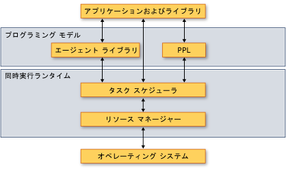

# <a name="overview-of-the-concurrency-runtime"></a>同時実行ランタイムの概要
このドキュメントでは、同時実行ランタイムの概要について説明します。 また、同時実行ランタイムの利点、使用する状況、コンポーネントどうしの対話方法、コンポーネントとオペレーティング システムやアプリケーションとの対話方法について説明します。  
  
> [!IMPORTANT]
>  Visual Studio 2015 以降では、同時実行ランタイムのタスク スケジューラは、ppltasks.h 内の task クラスや関連する型のためのスケジューラではなくなりました。 現在、これらの型では、パフォーマンスや Windows 同期プリミティブとの相互運用性を向上させるために、Windows のスレッド プールが使用されています。 parallel_for などの並列アルゴリズムでは引き続き、同時実行ランタイムのタスク スケジューラが使用されます。  
  
##  <a name="top"></a> セクション  
 このドキュメントは、次のトピックに分かれています。  
  
-   [同時実行ランタイムは、重要な理由](#runtime)  
  
-   [アーキテクチャ](#architecture)  
  
-   [C++ ラムダ式](#lambda)  
  
-   [Requirements](#requirements)  
  
##  <a name="runtime">同時実行ランタイムは、重要な理由</a>  
 同時実行用のランタイムでは、同時に実行されるアプリケーションおよびアプリケーション コンポーネントに統一性と予測可能性が提供されます。 同時実行ランタイムの利点の 2 つの例としては*協調タスク スケジューリング*と*協調ブロッキング*です。  
  
 同時実行ランタイムで使用される協調タスク スケジューラには、ワーク スティーリング アルゴリズムが実装されており、作業がコンピューティング リソース間に効率的に分散されます。 たとえば、同じランタイムによって管理される 2 つのスレッドを持つアプリケーションがあるとします。 一方のスレッドがスケジュールされたタスクを完了したら、他方のスレッドから作業をオフロードできます。 このメカニズムにより、アプリケーションの全体的な作業負荷のバランスが保たれます。  
  
 また、同時実行ランタイムでは、協調ブロッキングを使用して、リソースへのアクセスを同期する同期プリミティブも提供されます。 たとえば、共有リソースへの排他アクセスを必要とするタスクがあるとします。 ランタイムは協調的なブロッキングによって、最初のタスクがリソースを待機しているときに、残りのクォンタムを使用して別のタスクを実行できます。 このメカニズムにより、コンピューティング リソースを最大限に利用できます。  
  
 [[トップ](#top)]  
  
##  <a name="architecture"></a> アーキテクチャ  
 同時実行ランタイムは、並列パターン ライブラリ (PPL)、非同期エージェント ライブラリ、タスク スケジューラ、およびリソース マネージャーの 4 つのコンポーネントで構成されます。 これらのコンポーネントは、オペレーティング システムとアプリケーションの間に配置されます。 次の図は、同時実行ランタイムのコンポーネントがオペレーティング システムおよびアプリケーションとの間でどのようにやり取りするかを示しています。  
  
 **同時実行ランタイム アーキテクチャ**  
  
   
  
> [!IMPORTANT]
>  タスク スケジューラおよびリソース マネージャーのコンポーネントは、ppltasks.h に含まれるタスクのクラスまたはその他の種類を使用する場合またはユニバーサル Windows プラットフォーム (UWP) アプリからご利用いただけません。  
  
 同時実行ランタイムは、高*コンポーザブル*、つまりより多くの既存の機能を組み合わせることができます。 同時実行ランタイムでは、下位のコンポーネントから、並列アルゴリズムなど多数の機能を構成します。  
  
 また、同時実行ランタイムでは、協調ブロッキングを使用して、リソースへのアクセスを同期する同期プリミティブも提供されます。 これらの同期プリミティブの詳細については、次を参照してください。[同期データ構造](../../parallel/concrt/synchronization-data-structures.md)です。  
  
 以下のセクションでは、各コンポーネントが備えている機能と使用する場面についての概要を簡単に説明します。  
  
### <a name="parallel-patterns-library"></a>並列パターン ライブラリ  
 並列パターン ライブラリ (PPL) は、粒度の細かい並列化を実行するための汎用的なコンテナーとアルゴリズムを提供します。 Ppl での*命令型データの並列化*コンピューティング リソースをコレクションやデータのセット上の計算に分散する並列アルゴリズムを提供することによりします。 また、*タスクの並列処理*コンピューティング リソースを複数の独立した操作を分散するタスク オブジェクトを提供することによりします。  
  
 ローカルの計算で並列実行の利点を活用できる場合は、並列パターン ライブラリを使用します。 たとえば、使用することができます、 [concurrency::parallel_for](reference/concurrency-namespace-functions.md#parallel_for)既存を変換するためのアルゴリズム`for`ループを並列で動作します。  
  
 並列パターン ライブラリに関する詳細については、次を参照してください。[並列パターン ライブラリ (PPL)](../../parallel/concrt/parallel-patterns-library-ppl.md)です。  
  
### <a name="asynchronous-agents-library"></a>非同期エージェント ライブラリ  
 非同期エージェント ライブラリ (または単*エージェント ライブラリ*)、アクター ベースのプログラミング モデルとメッセージ パッシング インターフェイスの粒度の粗いデータ フローおよびパイプライン処理タスクの両方を提供します。 非同期エージェントを使用すると、他のコンポーネントがデータを待機しているときに作業を実行することにより、待機時間を生産的に活用できます。  
  
 相互に非同期通信を行う複数のエンティティがある場合に、エージェント ライブラリを使用します。 たとえば、データをファイルまたはネットワーク接続から読み取って、そのデータをメッセージ パッシング インターフェイスで別のエージェントに送信するエージェントを作成できます。  
  
 エージェント ライブラリに関する詳細については、次を参照してください。[非同期エージェント ライブラリ](../../parallel/concrt/asynchronous-agents-library.md)です。  
  
### <a name="task-scheduler"></a>タスク スケジューラ  
 タスク スケジューラは、実行時にタスクをスケジュールおよび調整します。 タスク スケジューラは他の処理と連携して行われ、ワーク スティーリング アルゴリズムを使用して処理リソースを最大限に活用します。  
  
 同時実行ランタイムには既定のスケジューラが用意されているため、インフラストラクチャの詳細を管理する必要はありません。 ただし、アプリケーションの品質ニーズを満たすために、独自のスケジューリング ポリシーを用意したり、特定のスケジューラを特定のタスクに関連付けたりすることもできます。  
  
 タスク スケジューラに関する詳細については、次を参照してください。[タスク スケジューラ](../../parallel/concrt/task-scheduler-concurrency-runtime.md)です。  
  
### <a name="resource-manager"></a>リソース マネージャー  
 リソース マネージャーの役割は、プロセッサやメモリなどのコンピューティング リソースを管理することです。 リソース マネージャーは、実行時の作業負荷の変更に応答して、効果が最も大きくなる場所にリソースを割り当てます。  
  
 リソース マネージャーは、コンピューティング リソースの抽象化として機能し、主にタスク スケジューラとやり取りします。 リソース マネージャーを使用してライブラリおよびアプリケーションのパフォーマンスを微調整できますが、通常は、並列パターン ライブラリ、エージェント ライブラリ、およびタスク スケジューラに備わった機能を使用します。 これらのライブラリでは、リソース マネージャーを使用して、作業負荷の変更に応じてリソースのバランスを直接的に再調整します。  
  
 [[トップ](#top)]  
  
##  <a name="lambda">C++ ラムダ式</a>  
 同時実行ランタイムで定義されている型やアルゴリズムの多くは、C++ テンプレートとして実装されています。 こうした型やアルゴリズムの中には、処理を実行するためのルーチンをパラメーターとして受け取るものがあります。 このパラメーターには、ラムダ関数、関数オブジェクト、または関数ポインターを使用できます。 これらのエンティティとも呼びます*作業関数*または*処理ルーチン*です。  
  
 ラムダ式は、Visual C++ 言語の重要な新機能の 1 つです。ラムダ式を使用すると、並列処理用の処理関数を簡潔に定義できます。 関数オブジェクトおよび関数ポインターを使用すると、既存のコードで同時実行ランタイムを使用できます。 ただし、新しいコードを記述するときには、安全性や生産性の面で優れたラムダ式を使用することをお勧めします。  
  
 次の例は、ラムダ関数、関数オブジェクト、および関数ポインターに複数の呼び出しでの構文を比較して、 [concurrency::parallel_for_each](reference/concurrency-namespace-functions.md#parallel_for_each)アルゴリズムです。 各呼び出し`parallel_for_each`内の各要素の 2 乗を計算する、さまざまな方法を使用して、 [std::array](../../standard-library/array-class-stl.md)オブジェクト。  
  
 [!code-cpp[concrt-comparing-work-functions#1](../../parallel/concrt/codesnippet/cpp/overview-of-the-concurrency-runtime_1.cpp)]  
  
 **出力**  
  
```Output  
1  
256  
6561  
65536  
390625  
```  
  
 C++ でのラムダ関数の詳細については、次を参照してください。[ラムダ式](../../cpp/lambda-expressions-in-cpp.md)です。  
  
 [[トップ](#top)]  
  
##  <a name="requirements"></a> 必要条件  
 次の表は、同時実行ランタイムの各コンポーネントに関連付けられているヘッダー ファイルを示しています。  
  
|コンポーネント|ヘッダー ファイル|  
|---------------|------------------|  
|並列パターン ライブラリ (PPL)|ppl.h<br /><br /> concurrent_queue.h<br /><br /> concurrent_vector.h|  
|非同期エージェント ライブラリ|agents.h|  
|タスク スケジューラ|concrt.h|  
|リソース マネージャー|concrtrm.h|  
  
 同時実行ランタイムが宣言されている、 [Concurrency](../../parallel/concrt/reference/concurrency-namespace.md)名前空間。 (使用することも[同時実行](../../parallel/concrt/reference/concurrency-namespace.md)、これは、この名前空間のエイリアスです)。`concurrency::details` 名前空間は、同時実行ランタイム フレームワークをサポートしますが、コードから直接使用することを目的としていません。  
  
 同時実行ランタイムは、C ランタイム ライブラリ (CRT) の一部として提供されます。 CRT を使用するアプリケーションを構築する方法の詳細については、次を参照してください。 [CRT ライブラリの機能](../../c-runtime-library/crt-library-features.md)します。  
  
 [[トップ](#top)]


