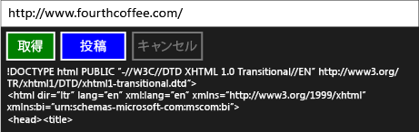

# チュートリアル: タスクおよび XML HTTP 要求を使用した接続
この例を使用する方法を示しています、 [IXMLHTTPRequest2](http://msdn.microsoft.com/en-us/bbc11c4a-aecf-4d6d-8275-3e852e309908)と[IXMLHTTPRequest2Callback](http://msdn.microsoft.com/en-us/aa4b3f4c-6e28-458b-be25-6cce8865fc71)インターフェイスを web サービスで、ユニバーサル Windows プラットフォーム (UWP に HTTP GET および POST 要求を送信するタスクと) アプリ。 タスクと `IXMLHTTPRequest2` を組み合わせることによって、他のタスクと共に構成するコードを記述できます。 たとえば、タスクのチェーンの一部としてダウンロード タスクを使用できます。 ダウンロード タスクは、処理が取り消された場合にも応答できます。  
  
> [!TIP]
>  また、C++ アプリを使用して、UWP アプリまたはデスクトップ C++ アプリからの HTTP 要求を実行するのに C++ REST SDK を使用することができます。 詳細については、次を参照してください。 [C++ REST SDK (コード名"Casablanca")](https://github.com/Microsoft/cpprestsdk)です。  
  
 タスクの詳細については、次を参照してください。[タスクの並列化](../../parallel/concrt/task-parallelism-concurrency-runtime.md)です。 UWP アプリでタスクを使用する方法の詳細については、次を参照してください。 [C++ で非同期プログラミング](/windows/uwp/threading-async/asynchronous-programming-in-cpp-universal-windows-platform-apps)と[非同期操作の作成に C++ UWP アプリの](../../parallel/concrt/creating-asynchronous-operations-in-cpp-for-windows-store-apps.md)します。  
  
 このドキュメントでは、最初に `HttpRequest` およびそのサポート クラスを作成する方法を示します。 C++ と XAML を使用する UWP アプリからこのクラスを使用する方法を示します。  
  
 使用するより詳細な例については、`HttpReader`クラスは、このドキュメントで説明を参照してください[開発 Bing マップ トリップ オプティマイザーでは、JavaScript および C++ で Windows ストア アプリ](http://msdn.microsoft.com/library/974cf025-de1a-4299-b7dd-c6c7bf0e5d30)です。 使用する別の例の`IXMLHTTPRequest2`がされていませんタスクを使用して、参照してください[クイック スタート: XML HTTP 要求 (IXMLHTTPRequest2) を使用した接続](http://msdn.microsoft.com/en-us/cc7aed53-b2c5-4d83-b85d-cff2f5ba7b35)です。  
  
> [!TIP]
>  `IXMLHTTPRequest2` および`IXMLHTTPRequest2Callback`は UWP アプリで使用することをお勧めするインターフェイスです。 また、この例をデスクトップ アプリケーションでの使用に適用することもできます。  
  
## 必須コンポーネント  
  
## HttpRequest、HttpRequestBuffersCallback、および HttpRequestStringCallback クラスを定義する  
 `IXMLHTTPRequest2` インターフェイスを使用して HTTP を通じた Web 要求を作成する場合、`IXMLHTTPRequest2Callback` インターフェイスを実装して、サーバーの応答を受け取り、他のイベントに対応します。 この例では `HttpRequest` クラスを定義して Web 要求を作成し、`HttpRequestBuffersCallback` と `HttpRequestStringCallback` クラスを定義して応答を処理しています。 `HttpRequestBuffersCallback` および `HttpRequestStringCallback` クラスは `HttpRequest` クラスをサポートします。`HttpRequest` クラスはアプリケーション コードからのみ使用できます。  
  
 `GetAsync` クラスの `PostAsync` および `HttpRequest` メソッドを使うと、HTTP GET および POST のそれぞれの操作を開始することができます。 これらのメソッドは、`HttpRequestStringCallback` クラスを使用して、サーバー応答を文字列として読み取ります。 `SendAsync` と `ReadAsync` のメソッドは、大きなコンテンツをストリーム転送することができます。 これらの各メソッドが返す[concurrency::task](../../parallel/concrt/reference/task-class.md)操作を表すです。 The `GetAsync` および `PostAsync` のメソッドは `task<std::wstring>` の値を生成し、`wstring` の部分がサーバーの応答を表します。 `SendAsync` および `ReadAsync` のメソッドは `task<void>` の値を生成します。これらのタスクは、送信と読み取り操作が完了すると、完了します。  
  
 `IXMLHTTPRequest2`インターフェイスは非同期に動作、この例では[concurrency::task_completion_event](../../parallel/concrt/reference/task-completion-event-class.md)コールバック オブジェクトが完了するか、ダウンロード操作をキャンセル後に完了するタスクを作成します。 `HttpRequest` クラスは、このタスクからタスク ベースの継続を作成し、最終結果を設定します。 `HttpRequest` クラスは、タスク ベースの継続を使って、前のタスクがエラーを生成したり取り消された場合でも、継続タスクが実行されるようにします。 タスク ベースの継続の詳細については、次を参照してください[タスクの並列化。](../../parallel/concrt/task-parallelism-concurrency-runtime.md)  
  
 取り消し操作をサポートするため、`HttpRequest`、`HttpRequestBuffersCallback`、および `HttpRequestStringCallback` のクラスは、キャンセル トークンを使用します。 `HttpRequestBuffersCallback`と`HttpRequestStringCallback`クラスを使用して、 [concurrency::cancellation_token::register_callback](reference/cancellation-token-class.md#register_callback)キャンセルに応答するタスクの完了イベントを有効にするメソッド。 この取り消しのコールバックは、ダウンロードを中止します。 取り消し処理の詳細については、次を参照してください。[キャンセル](../../parallel/concrt/exception-handling-in-the-concurrency-runtime.md#cancellation)です。  
  
#### HttpRequest クラスを定義するには  
  
1.  Visual C を使用して**新しいアプリケーション (XAML)**新しい XAML アプリケーション プロジェクトを作成するテンプレートです。 この例では、プロジェクトの名前を `UsingIXMLHTTPRequest2` とします。  
  
2.  プロジェクトに HttpRequest.h という名前のヘッダー ファイルと HttpRequest.cpp という名前のソース ファイルを追加します。  
  
3.  次のコードを pch.h に追加します。  
  
     [!code-cpp[concrt-using-ixhr2#1](../../parallel/concrt/codesnippet/cpp/walkthrough-connecting-using-tasks-and-xml-http-requests_1.h)]  
  
4.  次のコードを HttpRequest.h に追加します。  
  
     [!code-cpp[concrt-using-ixhr2#2](../../parallel/concrt/codesnippet/cpp/walkthrough-connecting-using-tasks-and-xml-http-requests_2.h)]  
  
5.  次のコードを HttpRequest.cpp に追加します。  
  
     [!code-cpp[concrt-using-ixhr2#3](../../parallel/concrt/codesnippet/cpp/walkthrough-connecting-using-tasks-and-xml-http-requests_3.cpp)]  
  
## UWP アプリで HttpRequest クラスを使用します。  
 このセクションでは、使用する方法を示します、 `HttpRequest` UWP アプリでのクラスです。 このアプリケーションは、URL リソースを定義する入力ボックス、GET と POST の操作を実行するボタン コマンド、現在の操作を取り消すボタン コマンドを提供します。  
  
#### HttpRequest クラスを使用するには  
  
1.  MainPage.xaml で、定義、 [StackPanel](http://msdn.microsoft.com/library/windows/apps/xaml/windows.ui.xaml.controls.stackpanel.aspx)要素は次のようにします。  
  
     [!code-xml[concrt-using-ixhr2#A1](../../parallel/concrt/codesnippet/xaml/walkthrough-connecting-using-tasks-and-xml-http-requests_4.xaml)]  
  
2.  MainPage.xaml.h で、この `#include` ディレクティブを追加します。  
  
     [!code-cpp[concrt-using-ixhr2#A2](../../parallel/concrt/codesnippet/cpp/walkthrough-connecting-using-tasks-and-xml-http-requests_5.h)]  
  
3.  MainPage.xaml.h で、これらの `private` メンバー変数を `MainPage` クラスに追加します。  
  
     [!code-cpp[concrt-using-ixhr2#A3](../../parallel/concrt/codesnippet/cpp/walkthrough-connecting-using-tasks-and-xml-http-requests_6.h)]  
  
4.  MainPage.xaml.h で `private` メソッド `ProcessHttpRequest` を宣言します。  
  
     [!code-cpp[concrt-using-ixhr2#A4](../../parallel/concrt/codesnippet/cpp/walkthrough-connecting-using-tasks-and-xml-http-requests_7.h)]  
  
5.  MainPage.xaml.cpp で、これらの `using` ステートメントを追加します。  
  
     [!code-cpp[concrt-using-ixhr2#A5](../../parallel/concrt/codesnippet/cpp/walkthrough-connecting-using-tasks-and-xml-http-requests_8.cpp)]  
  
6.  MainPage.xaml.cpp で、`GetButton_Click` クラスの `PostButton_Click`、 `CancelButton_Click`、 `MainPage` メソッドを実装します。  
  
     [!code-cpp[concrt-using-ixhr2#A6](../../parallel/concrt/codesnippet/cpp/walkthrough-connecting-using-tasks-and-xml-http-requests_9.cpp)]  
  
    > [!TIP]

    >  場合は、アプリでは、キャンセルのサポートは必要ありません、渡す[concurrency::cancellation_token:: none](reference/cancellation-token-class.md#none)を`HttpRequest::GetAsync`と`HttpRequest::PostAsync`メソッドです。  

  
7.  MainPage.xaml.cpp で `MainPage::ProcessHttpRequest` メソッドを実装します。  
  
     [!code-cpp[concrt-using-ixhr2#A7](../../parallel/concrt/codesnippet/cpp/walkthrough-connecting-using-tasks-and-xml-http-requests_10.cpp)]  
  
8.  プロジェクトのプロパティで **リンカー**、**入力**、指定`shcore.lib`と`msxml6.lib`です。  
  
 実行中のアプリケーションを次に示します。  
  
   
  
## 次の手順  
 [同時実行ランタイムのチュートリアル](../../parallel/concrt/concurrency-runtime-walkthroughs.md)  
  
## 参照  
 [タスクの並列化](../../parallel/concrt/task-parallelism-concurrency-runtime.md)   
 [PPL における取り消し処理](cancellation-in-the-ppl.md)   
 [C++ で非同期プログラミング](/windows/uwp/threading-async/asynchronous-programming-in-cpp-universal-windows-platform-apps)   
 [UWP アプリの C++ で非同期操作の作成](../../parallel/concrt/creating-asynchronous-operations-in-cpp-for-windows-store-apps.md)   
 [クイック スタート: XML HTTP 要求 (IXMLHTTPRequest2) を使用しての接続](http://msdn.microsoft.com/en-us/cc7aed53-b2c5-4d83-b85d-cff2f5ba7b35)   
 [task クラス (同時実行ランタイム)](../../parallel/concrt/reference/task-class.md)   
 [task_completion_event クラス](../../parallel/concrt/reference/task-completion-event-class.md)
