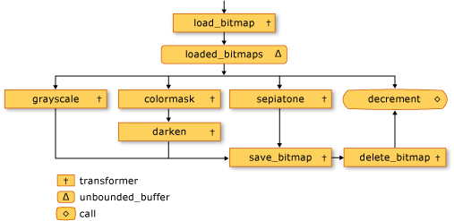
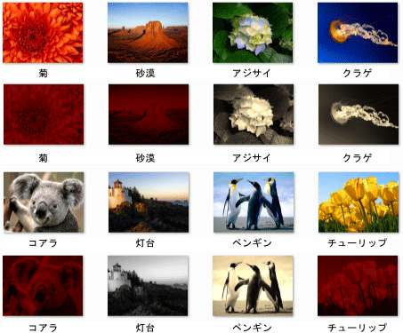

# チュートリアル: イメージ処理ネットワークの作成
このドキュメントでは、イメージ処理を実行する非同期メッセージ ブロックのネットワークを作成する方法を示します。  
  
 ネットワークでは、その特性に基づいてイメージを実行する操作を決定します。 この例では、*データフロー*モデルと、ネットワークを介してルート イメージをします。 このデータフロー モデルでは、プログラム内の独立したコンポーネント同士が、メッセージを送信することによって相互に通信します。 コンポーネントは、メッセージを受信したときに何らかのアクションを実行し、そのアクションの結果を別のコンポーネントに渡すできます。 これを比較、*制御フロー*モデルでは、アプリケーションによって使用される制御構造体、たとえば、条件付きステートメント、ループ、およびでは、プログラムで操作の順序を制御します。  
  
 データ フローに基づくネットワークを作成、*パイプライン*タスク。 同時に、パイプラインの各ステージには、全体的なタスクの一部を実行します。 これは、自動車製造の組み立てラインに例えることができます。 各車両が組み立てラインを通過には、1 つのステーションはフレームを組み立て、エンジン、およびな別がインストールされます。 複数の車両を同時にアセンブルするを有効にするは、組み立てラインは、一度に車両全体を組み立てるよりスループットを向上を提供します。  
  
## 必須コンポーネント  
 このチュートリアルを開始する前に、次のドキュメントを参照してください。  
  
-   [非同期メッセージ ブロック](../../parallel/concrt/asynchronous-message-blocks.md)  
  
-   [方法: メッセージ ブロック フィルターを使用する](../../parallel/concrt/how-to-use-a-message-block-filter.md)  
  
-   [チュートリアル: データフロー エージェントの作成](../../parallel/concrt/walkthrough-creating-a-dataflow-agent.md)  
  
 また、操作の基本を理解することをお勧め[!INCLUDE[ndptecgdiplus](../../parallel/concrt/includes/ndptecgdiplus_md.md)]このチュートリアルを開始する前にします。  
  
##   セクション  
 このチュートリアルは、次のセクションで構成されています。  
  
-   [イメージの処理機能を定義します。](#functionality)  
  
-   [イメージ処理ネットワークの作成](#network)  
  
-   [コード例全体](#complete)  
  
##  イメージの処理機能を定義します。  
 このセクションでは、ディスクから読み取られるイメージが使用する画像処理ネットワークの使用をサポート関数を示します。  
  
 次の関数では、`GetRGB`と`MakeColor`の抽出、およびそれぞれ特定の色の個々 のコンポーネントを結合します。  
  
 [!code-cpp[concrt-image-processing-filter#2](../../parallel/concrt/codesnippet/cpp/walkthrough-creating-an-image-processing-network_1.cpp)]  
  

 次の関数では、`ProcessImage`を呼び出し、指定された[std::function](../../standard-library/function-class.md)内の各ピクセルの色の値を変換するオブジェクト、 [!INCLUDE[ndptecgdiplus](../../parallel/concrt/includes/ndptecgdiplus_md.md)] [ビットマップ](https://msdn.microsoft.com/library/ms534420.aspx)オブジェクト。 `ProcessImage`関数は、 [concurrency::parallel_for](reference/concurrency-namespace-functions.md#parallel_for)アルゴリズムを並列にビットマップの各行を処理します。  

  
 [!code-cpp[concrt-image-processing-filter#3](../../parallel/concrt/codesnippet/cpp/walkthrough-creating-an-image-processing-network_2.cpp)]  
  
 次の関数では、 `Grayscale`、 `Sepiatone`、 `ColorMask`、および`Darken`、呼び出し、`ProcessImage`内の各ピクセルの色の値を変換する関数、`Bitmap`オブジェクト。 これらの各関数は、ラムダ式を使用して、1 ピクセルの色の変換を定義します。  
  
 [!code-cpp[concrt-image-processing-filter#4](../../parallel/concrt/codesnippet/cpp/walkthrough-creating-an-image-processing-network_3.cpp)]  
  
 次の関数では、`GetColorDominance`も呼び出して、`ProcessImage`関数。 ただし、それぞれの色の値を変更するには、代わりにこの関数を使用して[concurrency::combinable](../../parallel/concrt/reference/combinable-class.md)赤、緑、または青の色のコンポーネントにイメージがよりも優位かどうかを計算するオブジェクト。  
  
 [!code-cpp[concrt-image-processing-filter#5](../../parallel/concrt/codesnippet/cpp/walkthrough-creating-an-image-processing-network_4.cpp)]  
  
 次の関数では、`GetEncoderClsid`エンコーダーの指定された MIME の種類のクラス識別子を取得します。 アプリケーションでは、この関数を使用して、ビットマップのエンコーダーを取得します。  
  
 [!code-cpp[concrt-image-processing-filter#6](../../parallel/concrt/codesnippet/cpp/walkthrough-creating-an-image-processing-network_5.cpp)]  
  
 [[トップ](#top)]  
  
##  イメージ処理ネットワークの作成  
 このセクションでイメージ処理を実行する非同期メッセージ ブロックのネットワークを作成する方法について説明すべて[!INCLUDE[TLA#tla_jpeg](../../parallel/concrt/includes/tlasharptla_jpeg_md.md)]特定のディレクトリ内の (.jpg) イメージ。 ネットワークでは、次のようなイメージ処理操作を実行します。  
  
1.  Tom で作成したすべてのイメージをグレースケールに変換します。  
  
2.  すべてがイメージを基準となる色として赤、緑、青のコンポーネントを削除しの明るさを調整します。  
  
3.  他のイメージをセピア トーンを適用します。  
  
 ネットワークには、これらの条件のいずれかに一致する最初のイメージ処理操作のみが適用されます。 たとえば場合イメージ Tom で作成した基準となる色として赤、イメージはグレースケールに変換のみです。  
  
 ネットワークで実行する各イメージ処理操作後にその画像をディスクに保存ビットマップ (.bmp) ファイルとして。  
  
 次の手順は、この画像処理ネットワークを実装し、そのネットワークを適用する関数を作成する方法を示しますにすべて[!INCLUDE[TLA#tla_jpeg](../../parallel/concrt/includes/tlasharptla_jpeg_md.md)]特定のディレクトリ内のイメージです。  
  
#### 画像処理ネットワークを作成するには  
  
1.  関数を作成`ProcessImages`ディスク上のディレクトリの名前を取得します。  
  
     [!code-cpp[concrt-image-processing-filter#7](../../parallel/concrt/codesnippet/cpp/walkthrough-creating-an-image-processing-network_6.cpp)]  
  
2.  `ProcessImages`関数を作成、`countdown_event`変数。 `countdown_event`クラスは、このチュートリアルの後半で示すようにします。  
  
     [!code-cpp[concrt-image-processing-filter#8](../../parallel/concrt/codesnippet/cpp/walkthrough-creating-an-image-processing-network_7.cpp)]  
  
3.  作成、 [std::map](../../standard-library/map-class.md)オブジェクトを関連付ける、`Bitmap`元のファイル名を持つオブジェクト。  
  
     [!code-cpp[concrt-image-processing-filter#9](../../parallel/concrt/codesnippet/cpp/walkthrough-creating-an-image-processing-network_8.cpp)]  
  
4.  イメージ処理ネットワークのメンバーを定義する次のコードを追加します。  
  
     [!code-cpp[concrt-image-processing-filter#10](../../parallel/concrt/codesnippet/cpp/walkthrough-creating-an-image-processing-network_9.cpp)]  
  
5.  次のコードをネットワーク接続を追加します。  
  
     [!code-cpp[concrt-image-processing-filter#11](../../parallel/concrt/codesnippet/cpp/walkthrough-creating-an-image-processing-network_10.cpp)]  
  
6.  それぞれの完全なパスをネットワークの先頭に送信する次のコードを追加[!INCLUDE[TLA#tla_jpeg](../../parallel/concrt/includes/tlasharptla_jpeg_md.md)]ディレクトリ内のファイルです。  
  
     [!code-cpp[concrt-image-processing-filter#12](../../parallel/concrt/codesnippet/cpp/walkthrough-creating-an-image-processing-network_11.cpp)]  
  
7.  待って、`countdown_event`変数を 0 に到達します。  
  
     [!code-cpp[concrt-image-processing-filter#13](../../parallel/concrt/codesnippet/cpp/walkthrough-creating-an-image-processing-network_12.cpp)]  
  
 ネットワークのメンバーを次の表に示します。  
  
|メンバー|説明|  
|------------|-----------------|  
|`load_bitmap`|A [concurrency::transformer](../../parallel/concrt/reference/transformer-class.md)を読み込むオブジェクト、`Bitmap`ディスクからオブジェクトにエントリを追加、`map`にイメージを元のファイル名に関連付けるオブジェクト。|  
|`loaded_bitmaps`|A [concurrency::unbounded_buffer](reference/unbounded-buffer-class.md)イメージ処理フィルターに読み込まれたイメージを送信するオブジェクト。|  
|`grayscale`|A`transformer`グレースケール Tom によって作成されたイメージを変換するオブジェクト。 イメージのメタデータを使用して、その作成者を調べます。|  
|`colormask`|A`transformer`支配色として赤が設定されたイメージから緑、青の色要素を削除するオブジェクト。|  
|`darken`|A`transformer`支配色として赤が設定されたイメージが暗くなりますオブジェクト。|  
|`sepiatone`|A `transformer` Tom が作成していない、主に赤いではないイメージをセピア トーンを適用するオブジェクト。|  
|`save_bitmap`|A`transformer`保存、処理するオブジェクト`image`ビットマップとしてディスクにします。 `save_bitmap`元のファイル名を取得、`map`オブジェクトおよび .bmp にそのファイル名拡張子を変更します。|  
|`delete_bitmap`|A`transformer`イメージのメモリを解放するオブジェクト。|  
|`decrement`|A [concurrency::call](../../parallel/concrt/reference/call-class.md)ネットワーク内のターミナル ノードとして機能するオブジェクト。 これをデクリメント、`countdown_event`イメージが処理されたことをメインのアプリケーションに通知するオブジェクト。|  
  
 `loaded_bitmaps`メッセージ バッファーが重要なので、として、`unbounded_buffer`オブジェクトを提供`Bitmap`複数の受信者にオブジェクト。 ターゲット ブロックを受け入れると、`Bitmap`オブジェクト、`unbounded_buffer`オブジェクトが提供していないこと`Bitmap`オブジェクトを他の対象にします。 そのため、リンクする順序はオブジェクトを`unbounded_buffer`オブジェクトは重要です。 `grayscale`、 `colormask`、および`sepiatone`それぞれのブロックを受け入れるようにフィルターを使用してメッセージのみ特定`Bitmap`オブジェクト。 `decrement`メッセージ バッファーの重要なターゲットでは、`loaded_bitmaps`メッセージ バッファーをすべて受け入れる`Bitmap`他のメッセージ バッファーによって拒否されたオブジェクト。 `unbounded_buffer`の順序でメッセージを伝達するオブジェクトが必要です。 したがって、`unbounded_buffer`オブジェクトは、新しいターゲット ブロックは、自身にリンクされたしが現在のターゲット ブロックがそのメッセージを受け入れない場合にメッセージを受け入れるまでをブロックします。  
  
 アプリケーションでは、その複数のメッセージ ブロックの最初にメッセージを受け取り、1 つのメッセージ ブロックだけではなく、メッセージを処理が必要な場合、別のメッセージ ブロックの型をなど、使用できる`overwrite_buffer`です。 `overwrite_buffer`クラスは、一度に 1 つのメッセージを保持するが、そのメッセージを各ターゲットに伝達します。  
  
 次の図は、画像処理ネットワークを示しています。  
  
   
  
 `countdown_event`この例ではオブジェクトのすべてのイメージが処理されるときに、メイン アプリケーションに通知する画像処理ネットワークを有効にします。 `countdown_event`クラスの使用、 [concurrency::event](../../parallel/concrt/reference/event-class.md)オブジェクトからのカウンター値が 0 になったときに通知します。 メイン アプリケーションは、it がネットワークに、ファイル名を送信するたびにカウンターをインクリメントします。 ネットワーク デクリメントの末端のノード、カウンターの各イメージの処理が完了します。 メイン アプリケーションには、指定されたディレクトリが通過する時間後、まで待機する、`countdown_event`オブジェクトからそのカウンターをゼロに達したことを通知します。  
  
 次の例は、`countdown_event`クラス。  
  
 [!code-cpp[concrt-image-processing-filter#14](../../parallel/concrt/codesnippet/cpp/walkthrough-creating-an-image-processing-network_13.cpp)]  
  
 [[トップ](#top)]  
  
##  完全な例  
 コード例全体を次に示します。 `wmain`関数を管理、[!INCLUDE[ndptecgdiplus](../../parallel/concrt/includes/ndptecgdiplus_md.md)]ライブラリとの呼び出し、`ProcessImages`関数プロセスを[!INCLUDE[TLA#tla_jpeg](../../parallel/concrt/includes/tlasharptla_jpeg_md.md)]内のファイル、`Sample Pictures`ディレクトリ。  
  
 [!code-cpp[concrt-image-processing-filter#15](../../parallel/concrt/codesnippet/cpp/walkthrough-creating-an-image-processing-network_14.cpp)]  
  
 次の図は、サンプル出力を示します。 各ソース イメージでは、対応する変更したイメージの上です。  
  
   
  
 `Lighthouse`Tom Alphin で作成したし、したがってはグレースケールに変換します。 `Chrysanthemum`、 `Desert`、 `Koala`、および`Tulips`がある主要な色として赤青と緑の色のコンポーネントが削除され暗くなります。 `Hydrangeas`、 `Jellyfish`、および`Penguins`既定条件に一致し、したがって toned セピア は、します。  
  
 [[トップ](#top)]  
  
### コードのコンパイル  
 コード例をコピーし、Visual Studio プロジェクトに貼り付けるかという名前のファイルに貼り付けます`image-processing-network.cpp`Visual Studio コマンド プロンプト ウィンドウで、次のコマンドを実行します。  
  
 **cl.exe/DUNICODE/EHsc イメージの処理-network.cpp/link gdiplus.lib**  
  
## 参照  
 [同時実行ランタイムのチュートリアル](../../parallel/concrt/concurrency-runtime-walkthroughs.md)
