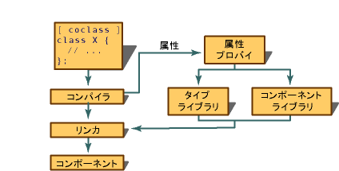

# 属性の基本的なしくみ
プロジェクトに属性を挿入する次の 3 つの方法はあります。 最初に、挿入できますに手動でソース コードです。 次に、プロジェクト内のオブジェクトのプロパティ グリッドを使用してそれらを挿入できます。 最後に、さまざまなウィザードを使用してそれらを挿入できます。 [プロパティ] ウィンドウとさまざまなウィザードの使用に関する詳細については、次を参照してください。 [Visual c プロジェクトの管理の作成と](../ide/creating-and-managing-visual-cpp-projects.md)です。  
  
 としてする前に、プロジェクトのビルド時に、コンパイラ解析各 C++ ソース ファイルのオブジェクト ファイルを生成します。 ただし、コンパイラには、属性が検出されると、解析、構文を検査します。 コンパイラ、動的にプロバイダーを呼び出して、属性をコードの挿入やコンパイル時にその他の変更を加えます。 プロバイダーの実装は、属性の種類によって異なります。 たとえば、ATL 関連の属性は、Atlprov.dll によって実装されます。  
  
 次の図は、コンパイラと、属性プロバイダー間のリレーションシップを示しています。  
  
   
  
> [!NOTE]
>  属性の使用方法には、ソース ファイルの内容は変更されません。 生成された属性のコードが表示されている間のみです、デバッグ セッションです。 さらに、プロジェクト内の各ソース ファイルの属性を置換した結果を表示するテキスト ファイルを生成できます。 この手順の詳細については、次を参照してください。 [/Fx (挿入されたコードのマージ)](../build/reference/fx-merge-injected-code.md)と[挿入されたコードのデバッグ](/visualstudio/debugger/how-to-debug-injected-code)です。  
  
 ほとんどの C++ コンストラクトのような属性は、適切な使用方法を定義する一連の特性があります。 これし、呼ばれ属性のコンテキスト属性コンテキストのテーブルの各属性のリファレンス トピックで説明されています。 たとえば、[コクラス](../windows/coclass.md)属性のみ適用できます既存のクラスまたは構造体にはなく、 [cpp_quote](../windows/cpp-quote.md)属性は、C++ ソース ファイル内のどこにでも挿入できます。  
  
## 参照  
 [概念](../windows/attributed-programming-concepts.md)