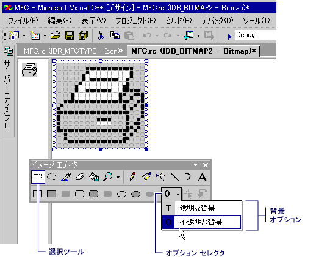

# 透明または不透明な背景の選択 (アイコン用イメージ エディター)
移動またはイメージから、選択内容をコピーするときに現在の背景色に一致するピクセルが、選択では、既定で、透過的です。ターゲットの場所にピクセルそれらが見えにくくならないしないでください。  
  
 、不透明な背景を透明な背景 (既定値) からに切り替えるし、再びことができます。 選択ツールを使用する場合、**透明な背景**と**不透明な背景**オプション セレクター内に表示されるオプション、**イメージ エディター**ツールバー (以下に示す) です。  
  
   
イメージ エディターのツールバーでオプションを透過的かつ非透過  
  
### 透過的なと不透明な背景間を切り替える  
  
1.  **イメージ エディター**ツールバーで、をクリックして、**オプション**セレクター、し、適切な背景。  
  
    -   **不透明な背景 (O)**: 既存のイメージが選択範囲のすべての部分によって隠されています。  
  
    -   **透明な背景 (T)**: 既存のイメージを選択範囲の現在の背景色に一致する部分を示しています。  
  
 \- または  
  
-   **イメージ** を選択またはクリア**背景色を不透明**です。  
  
 選択が既にイメージのどの部分は透過的に変更する効果の中には、背景色を変更することができます。  
  
 マネージ プロジェクトにリソースを追加する方法についてを参照してください[デスクトップ アプリでのリソース](/dotnet/framework/resources/index)で、 *.NET Framework 開発者ガイド 』。* マネージ プロジェクトにリソース ファイルを手動で追加する、リソースにアクセスする、静的リソースの表示方法、およびリソース文字列のプロパティを割り当てる方法については、次を参照してください。[デスクトップ アプリのリソース ファイルの作成](/dotnet/framework/resources/creating-resource-files-for-desktop-apps)です。 詳細については、管理対象アプリ内のリソースのグローバリゼーションとローカリゼーションは、次を参照してください。[グローバライズと .NET Framework アプリケーションのローカライズ](/dotnet/standard/globalization-localization/index)です。  
  
 必要条件  
  
 なし  
  
## 参照  
 [アクセラレータ キー](../windows/accelerator-keys-image-editor-for-icons.md)   
 [カラーを使用します。](../windows/working-with-color-image-editor-for-icons.md)