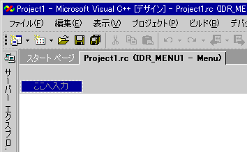

# メニューの作成
> [!NOTE]
>  [リソース] ウィンドウは Express Edition では使用できません。  
  
### 標準メニューを作成するには  
  
1.  **[表示]** メニューの **[リソース ビュー]** をクリックし、 **[メニュー]** 見出しを右クリックし、 **[リソースの追加]**をクリックします。 **[メニュー]**をクリックします。  
  
2.  メニュー バーで、"ここへ入力" と表示されている四角形の **[新しい項目]** ボックスを選びます。  
  
       
[新しい項目] ボックス  
  
3.  たとえば「ファイル」など、新しいメニューの名前を入力します。  
  
     入力したテキストは、 **メニュー** エディターと、 **プロパティ ウィンドウ** の [[キャプション]](/visualstudio/ide/reference/properties-window)ボックスの両方に表示されます。 新しいメニューのプロパティはこのどちらからでも編集できます。  
  
     メニュー バーで新しいメニューの名前を指定すると、さらに別のメニューを追加できるように [新しい項目] ボックスが右に移動し、最初のメニューの下に新しい [新しい項目] ボックスが表示されます。この新しいボックスでメニュー コマンドを追加できます。  
  
       
メニュー名の入力後にフォーカスが移動した [新しい項目] ボックス  
  
    > [!NOTE]
    >  メニュー バーで単一項目のメニューを作成するには、[Popup] プロパティを [False] に設定します。  
  
 マネージ プロジェクトにリソースを追加する方法についてを参照してください[デスクトップ アプリでのリソース](https://msdn.microsoft.com/library/f45fce5x.aspx)で、 *.NET Framework 開発者ガイド 』。* マネージ プロジェクトにリソース ファイルを手動で追加する、リソースにアクセスする、静的リソースの表示方法、およびリソース文字列のプロパティを割り当てる方法については、次を参照してください。[デスクトップ アプリのリソース ファイルの作成](https://msdn.microsoft.com/library/xbx3z216.aspx)です。 詳細については、管理対象アプリ内のリソースのグローバリゼーションとローカリゼーションは、次を参照してください。[グローバライズと .NET Framework アプリケーションのローカライズ](https://msdn.microsoft.com/library/h6270d0z.aspx)です。  
  
 **Requirements**  
  
 Win32  
  
## 関連項目  
 [メニュー エディター](../windows/menu-editor.md)