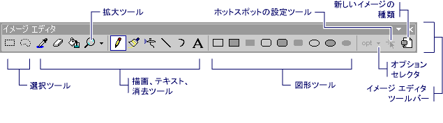
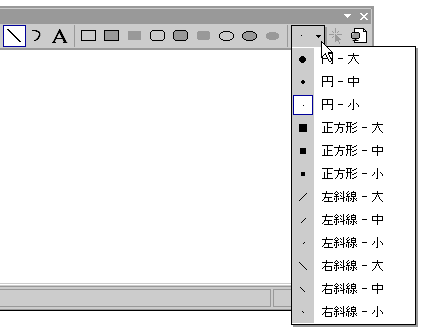

# ツール バー (アイコン用イメージ エディター)
**イメージ エディター**ツールバーには、描画、ペイント、テキストを入力する、消去、およびビューの操作用のツールが含まれています。 オプション セレクター、各ツールを使用するオプションを選択することができますも含まれています。 たとえば、さまざまなブラシの幅、拡大率、および線のスタイルから選択することができます。  
  
> [!NOTE]
>  使用できるすべてのツール、**イメージ エディター**ツールバーも使用できます、**イメージ**メニュー (下にある、**ツール**コマンド)。  
  
   
[イメージ エディター] ツール バー  
  
 使用する、**イメージ エディター**ツールバーと**オプション**セレクター、[ツール] をクリックまたはするオプションです。  
  
> [!TIP]
>  ツール ヒントは、ツールバーのボタンの上にカーソルを置くと表示されます。 これらのヒントを使用する各ボタンの機能を特定できます。  
  
 **オプション**セレクター線、マーカーなどの幅を指定することができます。上のアイコン、**オプション**セレクター ボタンが選択したツールを変更します。  
  
   
イメージ エディターのツールバーでオプション セレクター  
  
 マネージ プロジェクトにリソースを追加する方法についてを参照してください[デスクトップ アプリでのリソース](/dotnet/framework/resources/index)で、 *.NET Framework 開発者ガイド 』。* マネージ プロジェクトにリソース ファイルを手動で追加する、リソースにアクセスする、静的リソースの表示方法、およびリソース文字列のプロパティを割り当てる方法については、次を参照してください。[デスクトップ アプリのリソース ファイルの作成](/dotnet/framework/resources/creating-resource-files-for-desktop-apps)です。 詳細については、管理対象アプリ内のリソースのグローバリゼーションとローカリゼーションは、次を参照してください。[グローバライズと .NET Framework アプリケーションのローカライズ](/dotnet/standard/globalization-localization/index)です。  
  
## 必要条件  
 なし  
  
## 参照  
 [表示するか、ツールバーを非表示](displaying-or-hiding-the-toolbar-image-editor-for-icons.md)   
 [アクセラレータ キー](../windows/accelerator-keys-image-editor-for-icons.md)   
 [アイコン用イメージ エディター](../windows/image-editor-for-icons.md)

