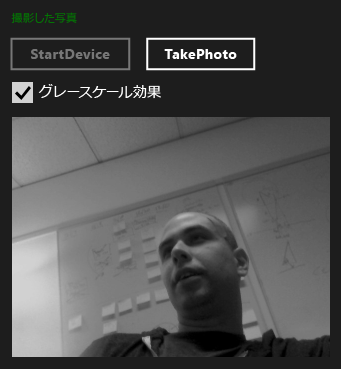

# チュートリアル: WRL および Media Foundation を使用した Windows ストア アプリの作成
[!INCLUDE[vs2017banner](../assembler/inline/includes/vs2017banner.md)]

使用する方法について、 [!INCLUDE[cppwrl](../windows/includes/cppwrl_md.md)] ([!INCLUDE[cppwrl_short](../windows/includes/cppwrl_short_md.md)]) を作成する、 [!INCLUDE[win8_appname_long](../build/includes/win8_appname_long_md.md)] を使用するアプリ [Microsoft Media Foundation](http://msdn.microsoft.com/library/windows/apps/ms694197)します。  
  
 この例では、Web カメラからキャプチャしたイメージにグレースケール効果を適用するカスタム メディア ファンデーション変換を作成します。 アプリでは、カスタム変換の定義のために C++ を使用し、キャプチャしたイメージを変換するコンポーネントを使用するために C# を使用しています。  
  
> [!NOTE]
>  C# の代わりに、JavaScript、Visual Basic、または C++ でカスタム変換コンポーネントを使用することもできます。  
  
 ほとんどの場合、[!INCLUDE[wrt](../atl/reference/includes/wrt_md.md)] コンポーネントの作成には [!INCLUDE[cppwrt](../build/reference/includes/cppwrt_md.md)] ([!INCLUDE[cppwrt_short](../Token/cppwrt_short_md.md)]) を使用できます  (詳細については、次を参照してください [。Visual C 言語リファレンス](../Topic/Visual%20C++%20Language%20Reference%20\(C++-CX\).md).)ただし、場合によっては [!INCLUDE[cppwrl_short](../windows/includes/cppwrl_short_md.md)] を使用する必要があります。 たとえば、Microsoft メディア ファンデーションのメディア拡張機能を作成する場合、COM および [!INCLUDE[wrt](../atl/reference/includes/wrt_md.md)] インターフェイスの両方を実装するコンポーネントを作成する必要があります。 [!INCLUDE[cppwrt_short](../Token/cppwrt_short_md.md)] が作成できるのは [!INCLUDE[wrt](../atl/reference/includes/wrt_md.md)] オブジェクトのみであるため、メディア拡張機能を作成するには、COM および [!INCLUDE[wrt](../atl/reference/includes/wrt_md.md)] インターフェイスの両方の実装を可能にする [!INCLUDE[cppwrl_short](../windows/includes/cppwrl_short_md.md)] を使用することが必要です。  
  
> [!NOTE]
>  このコード例は長いですが、役に立つメディア ファンデーション変換を作成するために必要な最低限のコードを示しています。 独自のカスタム変換を作成するための出発点として、このコード例を使用することができます。 この例は、 [メディア拡張機能サンプル](http://code.msdn.microsoft.com/windowsapps/Media-extensions-sample-7b466096), 、ビデオに影響を受けるはメディアの拡張を適用、ビデオのデコードおよびメディア ストリームを生成するスキームのハンドラーを作成します。  
  
## 必要条件  
  
-   発生すると、 [Windows ランタイム](http://msdn.microsoft.com/library/windows/apps/br211377.aspx)します。  
  
-   COM の使用経験。  
  
-   Web カメラ。  
  
## 主要なポイント  
  
-   カスタム メディア ファンデーション コンポーネントを作成するには、Microsoft インターフェイス定義言語 (MIDL) の定義ファイルを使用してインターフェイスを定義し、そのインターフェイスを実装して、他のコンポーネントからアクティブ化できるようにします。  
  
-    `namespace` と `runtimeclass` 属性、および `NTDDI_WIN8`[バージョン](http://msdn.microsoft.com/ja-jp/66ac5cf3-2230-44fd-aaf6-8013e4a4ae81) 属性の値を使用するメディア ファンデーション コンポーネントの MIDL の定義の重要な部分を [!INCLUDE[cppwrl_short](../windows/includes/cppwrl_short_md.md)]です。  
  
-   [Microsoft::WRL::RuntimeClass](../windows/runtimeclass-class.md) カスタム メディア ファンデーション コンポーネントの基本クラスです。  [Microsoft::WRL::RuntimeClassType::WinRtClassicComMix](../windows/runtimeclasstype-enumeration.md) テンプレート引数として提供される列挙値として使用する両方のクラスをマークする、 [!INCLUDE[wrt](../atl/reference/includes/wrt_md.md)] クラスと、従来の COM ランタイム クラスです。  
  
-    [InspectableClass](../windows/inspectableclass-macro.md) マクロは、参照カウントなどの基本的な COM 機能を実装し、 `QueryInterface` メソッド、およびランタイム クラス名と信頼レベルを設定します。  
  
-   使用、microsoft::wrl::[モジュール クラス](https://www.microsoftonedoc.com/#/organizations/e6f6a65cf14f462597b64ac058dbe1d0/projects/3fedad16-eaf1-41a6-8f96-0c1949c68f32/containers/a3daf831-1c5f-4bbe-964d-503870caf874/tocpaths/b4acf5de-2f4c-4c8b-b5ff-9140d023ecbe/locales/en-US) など DLL エントリ ポイント関数を実装する [DllGetActivationFactory](http://msdn.microsoft.com/library/br205771.aspx), 、[DllCanUnloadNow](http://msdn.microsoft.com/library/windows/desktop/ms690368\(v=vs.85\).aspx), と [DllGetClassObject](http://msdn.microsoft.com/library/windows/desktop/ms680760\(v=vs.85\).aspx)します。  
  
-   コンポーネント DLL を runtimeobject.lib にリンクします。 指定 [/WINMD](../Topic/Compiler%20and%20Linker%20options%20\(C++-CX\).md) Windows メタデータを生成するリンカーのコマンドラインにします。  
  
-   プロジェクト参照を使用して、[!INCLUDE[cppwrl_short](../windows/includes/cppwrl_short_md.md)] コンポーネントを [!INCLUDE[win8_appname_long](../build/includes/win8_appname_long_md.md)] アプリからアクセスできるようにします。  
  
### [!INCLUDE[cppwrl_short](../windows/includes/cppwrl_short_md.md)] を使用して、メディア ファンデーションのグレースケール変換コンポーネントを作成するには  
  
1.  Visual Studio で作成、 **空のソリューション** プロジェクトです。 など、プロジェクトの名前 `MediaCapture`します。  
  
2.  追加、 **DLL (Windows ストア アプリ)** プロジェクトがソリューションにします。 など、プロジェクトの名前 `GrayscaleTransform`します。  
  
3.  追加、 **Midl ファイル (.idl)** 、プロジェクトへのファイルです。 など、ファイルの名前 `GrayscaleTransform.idl`します。  
  
4.  次のコードを GrayscaleTransform.idl に追加します。  
  
     [!code-cpp[wrl-media-capture#1](../windows/codesnippet/CPP/walkthrough-creating-a-windows-store-app-using-wrl-and-media-foundation_1.idl)]  
  
5.  次のコードを使用して pch.h の内容を置き換えます。  
  
     [!code-cpp[wrl-media-capture#2](../windows/codesnippet/CPP/walkthrough-creating-a-windows-store-app-using-wrl-and-media-foundation_2.h)]  
  
6.  プロジェクトに新しいヘッダー ファイルを追加、名前を付けます `BufferLock.h`, 、このコードを追加します。  
  
     [!code-cpp[wrl-media-capture#3](../windows/codesnippet/CPP/walkthrough-creating-a-windows-store-app-using-wrl-and-media-foundation_3.h)]  
  
7.  GrayscaleTransform.h は、この例では使用しません。 このファイルは必要に応じてプロジェクトから削除できます。  
  
8.  次のコードを使用して GrayscaleTransform.cpp の内容を置き換えます。  
  
     [!code-cpp[wrl-media-capture#4](../windows/codesnippet/CPP/walkthrough-creating-a-windows-store-app-using-wrl-and-media-foundation_4.cpp)]  
  
9. プロジェクトに新しいモジュール定義ファイルを追加、名前を付けます `GrayscaleTransform.def`, 、このコードを追加します。  
  
     [!CODE [wrl-media-capture#5](../CodeSnippet/VS_Snippets_Misc/wrl-media-capture#5)]  
  
10. 次のコードを使用して dllmain.cpp の内容を置き換えます。  
  
     [!code-cpp[wrl-media-capture#6](../windows/codesnippet/CPP/walkthrough-creating-a-windows-store-app-using-wrl-and-media-foundation_6.cpp)]  
  
11. プロジェクトの **プロパティ ページ** ] ダイアログ ボックスで、次の設定 **リンカー** プロパティです。  
  
    1.   **入力**, 、に対して、 **モジュール定義ファイル**, 、指定 `GrayScaleTransform.def`します。  
  
    2.  でも **入力**, 、追加 `runtimeobject.lib`, 、`mfuuid.lib`, 、および `mfplatf.lib` に、 **追加の依存関係** プロパティです。  
  
    3.  [ **Windows メタデータ**, 、 **Windows メタデータの生成** に **[はい] (/WINMD)**します。  
  
### C# アプリから [!INCLUDE[cppwrl_short](../windows/includes/cppwrl_short_md.md)] とカスタム メディア ファンデーション コンポーネントを使用するには  
  
1.  新しい **c# 新しいアプリケーション (XAML)** プロジェクトを `MediaCapture` ソリューションです。 など、プロジェクトの名前 `MediaCapture`します。  
  
2.   **MediaCapture** プロジェクトへの参照を追加、 `GrayscaleTransform` プロジェクトです。 については、参照する方法、 [する方法: 追加または参照マネージャーを使用して参照を削除する](../Topic/How%20to:%20Add%20or%20Remove%20References%20By%20Using%20the%20Reference%20Manager.md)です。  
  
3.  Package.appxmanifest で、上、 **機能** ] タブで [ **マイク** と **web カメラ**します。 Web カメラから写真をキャプチャするために、両方の機能が必要です。  
  
4.  MainPage.xaml で、ルートにこのコードを追加します [グリッド](http://msdn.microsoft.com/library/windows/apps/xaml/windows.ui.xaml.controls.grid.aspx) 要素。  
  
     [!code-xml[wrl-media-capture#7](../windows/codesnippet/Xaml/walkthrough-creating-a-windows-store-app-using-wrl-and-media-foundation_7.xaml)]  
  
5.  次のコードを使用して MainPage.xaml.cs の内容を置き換えます。  
  
     [!code-cs[wrl-media-capture#8](../windows/codesnippet/CSharp/walkthrough-creating-a-windows-store-app-using-wrl-and-media-foundation_8.cs)]  
  
 次の図は、MediaCapture アプリを示しています。  
  
   
  
## 次の手順  
 例では、既定の Web カメラから写真を 1 枚ずつキャプチャする方法を示します。  [メディア拡張機能サンプル](http://code.msdn.microsoft.com/windowsapps/Media-extensions-sample-7b466096) よりします。 そのサンプルでは、Web カメラ デバイスを列挙し、ローカル スキーム ハンドラーを使用する方法や、個別の写真とビデオ ストリームの両方で機能する追加のメディア効果について示します。  
  
## 関連項目  
 [Windows ランタイム C++ テンプレート ライブラリ (WRL)](../Topic/Windows%20Runtime%20C++%20Template%20Library%20\(WRL\).md)   
 [Microsoft Media Foundation](http://msdn.microsoft.com/library/windows/apps/ms694197)   
 [メディアの拡張機能サンプル](http://code.msdn.microsoft.com/windowsapps/Media-extensions-sample-7b466096)